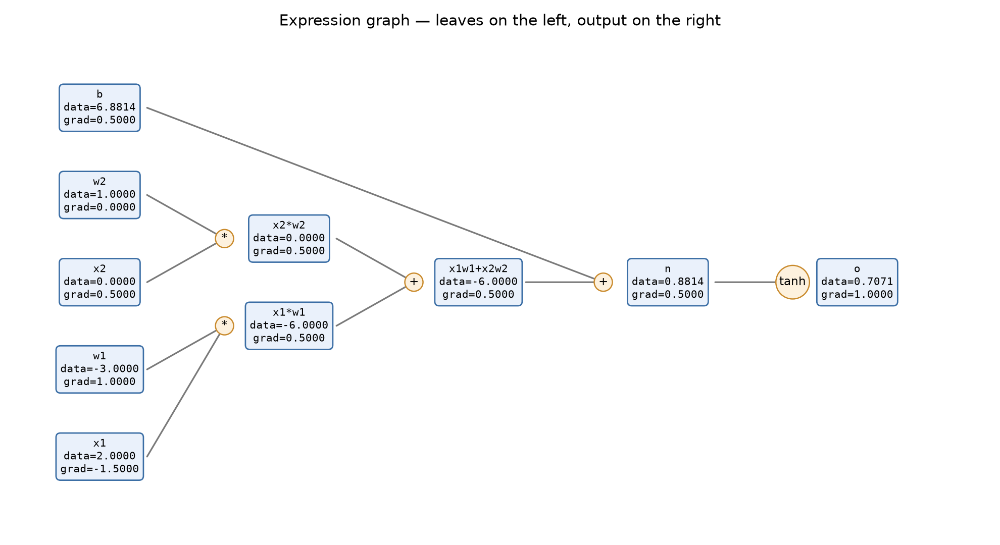
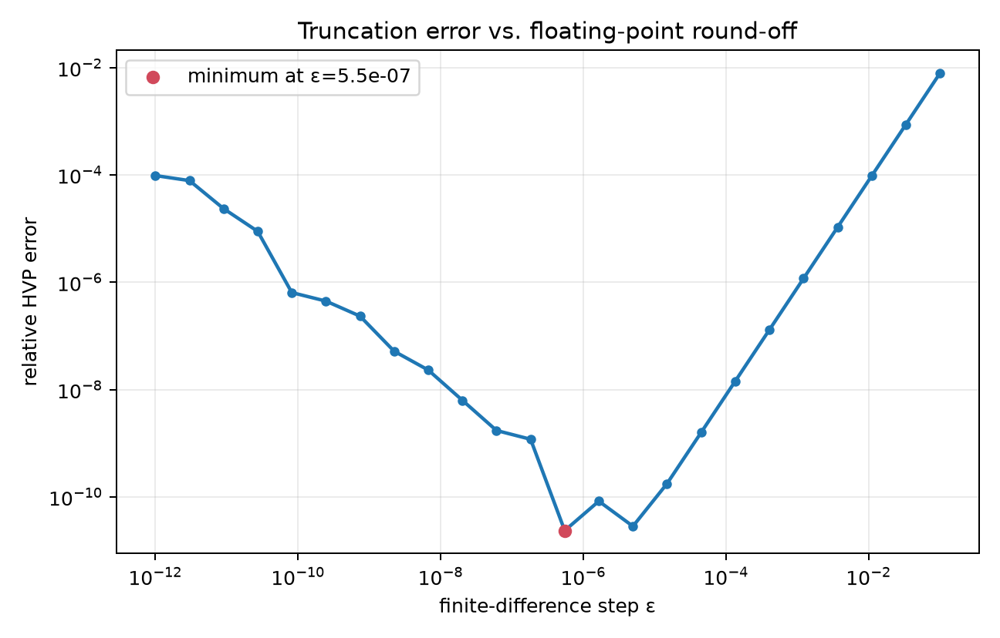
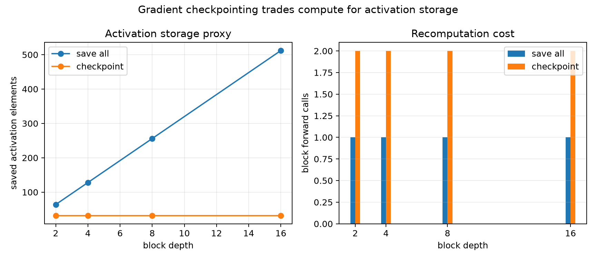
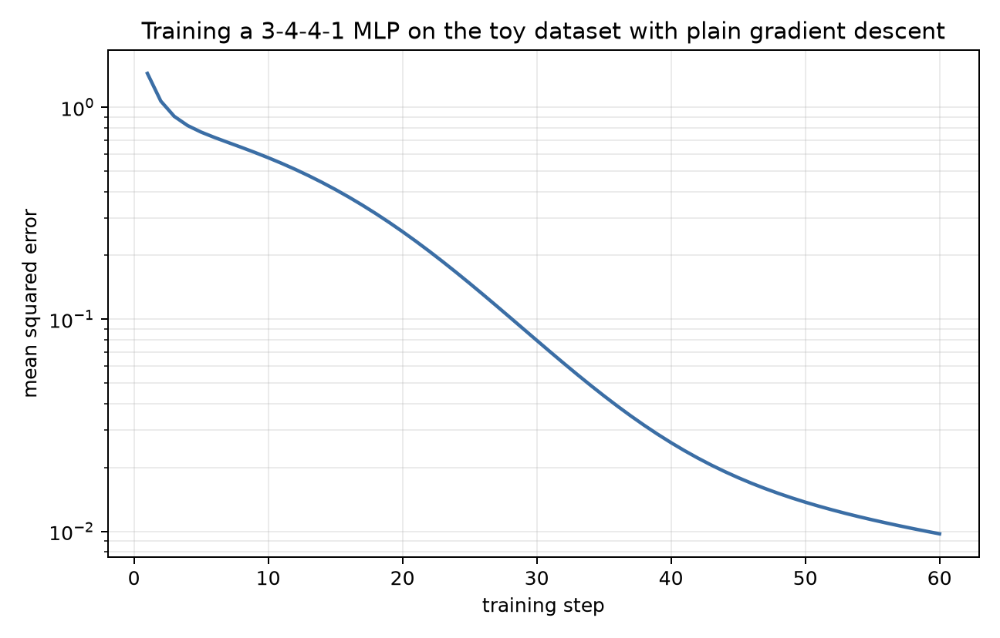

# 第 1 章、手动实现自动微分引擎

训练神经网络时，我们习惯写下 `loss.backward()`，然后从参数的 `.grad` 里取出梯度。这个接口非常短小，以至于计算图、链式法则、拓扑调度、梯度累加和张量形状处理都被藏在了一个方法调用后面。

本章要拆开这个黑箱。我们会先手写一个标量 `Value` 引擎，观察一个数怎样在前向计算时变成图节点，并且我们会将计算图绘画出来、手算一遍链式法则；再升级为基于 NumPy 的 `Tensor` 引擎，亲自处理广播、规约、矩阵乘法和非标量输出。在完成核心引擎后，为了验证工作的有效性，我们采用中心差分和 `torch.autograd.grad` 独立对拍。随后沿同一套机制理解两个已广泛使用的扩展——Hessian-vector product（HVP）与梯度检查点——最后利用这台自己打造的反向传播引擎训练一个真正的小型神经网络，看着 loss 曲线降下去。

本章的教学主入口是 [01_autograd_engine.ipynb](../code/ch01/01_autograd_engine.ipynb)。它按概念分块，保存了数值结果和图表，可以从第一格开始逐步运行。`value.py`、`tensor.py`、`extensions.py`、`viz.py` 与 `mlp.py` 则是 Notebook 调用的真实模块，适合 pytest、批量实验以及后续章节复用。

## 一、原理与数学推导

我们将通过下面这个简单的计算过程进行讲解，假如我们有如下计算表达式：

```python
a, b, c = 2.0, -3.0, 10.0     # 假设这三个参数是我们网络的输入变量
u = a * b + c                 # 这是中间层计算结果， u = -6 + 10 = 4
y = u ** 2                    # 这是网络最终输出结果，y = 16
```

计算目标是求解：$$
\frac{\partial y}{\partial a},\quad
\frac{\partial y}{\partial b},\quad
\frac{\partial y}{\partial c}
$$
首先需要明确：所谓“求导”，到底在干什么？导数表达的含义为：当程序的某个输入 `a` 发生一个非常小的变化时，最终输出 `y` 会变化多少？或者简单地说，**y 对 a 有多敏感。**

例如：$\frac{\partial y}{\partial a}=-24$，这意味着在当前位置附近，如果：$a\rightarrow a+\Delta a$，那么有，$y\approx y-24\Delta a$。比如，当 $\Delta a=0.001$，大约就有$\Delta y\approx -24\times0.001=-0.024$。所以导数本质上不是“数学课上的符号操作”，而是：**局部敏感度。**

现在问：如果把 `a` 从 `2.0` 增加到 `2.0001`，`y` 会变化多少？要回答这个问题，实际上有三条路可走。

### 1.1 路线一：有限差分 —— 真的把 a 改一点

这是最直觉的方法。初始时，$a = 2$，计算可得 $y(2)=16$，然后重新令 $a = 2.0001$，再完整跑一次程序。

这里要计算的原函数实际上是：$f(a)=(ab+c)^2$，其中 $b=-3,\quad c=10$，所以 $f(a)=(-3a+10)^2$，因此计算可得 $f(2.0001)=(-6.0003+10)^2=3.9997^2=15.99760009$。

进一步计算，$\Delta y=15.99760009-16 \approx -0.00239991$，$\Delta a=0.0001$，$\frac{\Delta y}{\Delta a} \approx \frac{-0.00239991}{0.0001} \approx -23.9991$，非常接近真实导数 $-24$。这就是有限差分计算方法。

需要注意的是，在实际操作过程中，我们通常不采用$$
\frac{f(x+\epsilon)-f(x)}{\epsilon}
$$这种计算方式，而是采用更常见的是中心差分计算方式：
$$
\frac{f(x+\epsilon)-f(x-\epsilon)}{2\epsilon}
$$
因为中心差分通常误差更小。直觉上可以想象成，不是只站在当前位置往右看斜率，而是：**左边看一点 + 右边看一点，取一个更加对称的局部斜率**。

需要注意的是，这里的 $\epsilon$ 并不能无限的小，这受限于计算机对浮点数本身的表示精度，因此理论上来说，有限差分只是一种近似计算方法。 

然而，**有限差分最大的问题不是“不精确”，而是代价“太贵”**，假如我们的模型只有三个参数，每为了计算对一个参数的导数，就要对该参数值进行一次微调并完整计算一次。但现在网络动辄几十、几百亿的参数量，这对于有限差分计算方法来说显然是不切实际的。

所以有限差分方法并不适用于网络训练阶段，但可**用于检查梯度实现的是否准确，这其实就是梯度检查(gradient check)**。

### 1.2 路线二：符号微分 —— 把整个程序变成公式

既然我们要计算导数，为何不采用数学课本中的导数计算方法，罗列公式直接根据求导法则进行计算化简，并带入数值计算呢？

例如，我们直接代进去：$$
y=(ab+c)^2
$$那么：$$
\frac{\partial y}{\partial a}
=
2(ab+c)b
$$
直接代入：$a=2,b=-3,c=10$，得到 $2\times4\times(-3)=-24$，实现了数学上非常精准的导数计算。

那为什么 PyTorch 等计算框架不直接采用这种符号微分计算方法呢？

因为真实的程序并不是我们看到的，诸如 $y=(ab+c)^2$ 这么简单。例如下方展示的代码中，

```python
def f(x):
    if x.mean() > 0:
        y = x ** 2
    else:
        y = x ** 3

    for i in range(int(x[0])):
        y = torch.sin(y)

    return y.sum()
```

由于这里存在 `if` 分支语句，那么问题来了，这里的符号系统由于无法提前得知会采用哪个分支的表达式，因而无法构造表达式 $f(x)=???$，再比如这里的 `for` 循环语句，由于无法提前获知循环次数，也无法事先精准合成计算表达式。而这一切都需要等到真实的给定一个 `x` 值，程序跑起来以后才能知道。

这就是“数学表达式”和“程序”的区别。

### 1.3 路线二：自动微分 —— 边走边算

于是自动微分 (automatic differentiation，AD) 出现了，AD 的思路非常巧妙，它并不试图 “把整个程序化简成一个巨大的公式”。而是说：**只需要知道每个最基本操作怎么求导**。这些所谓的基本操作实际上就是我们在微积分课本中看到的常见函数求导公式，以及基本的函数求导法则等。

现代 LLM 等神经网络无论有多么复杂，其本质上，网络中间层之间的计算本质上还是矩阵的乘法、加法以及非线性激活函数的计算等，这些基本的运算通常求导都是非常简单直接的。

因此，AD 核心原理就是负责利用链式法则把这些局部导数连接起来。

回到我们上面的示例中，我们通过计算图的方式进行 AD 拆解：

```text
a ──┐
    × ── d ──┐
b ──┘        + ── u ── square ── y
         c ──┘
```

为了方便展示，我们把 $a \times b$ 的计算结果作为 $d$，这是非常直观的计算图，我们只需要在左侧带入相应的输入值，并按指定的计算符号一步步向右执行就可以得到最终计算结果。

接下来，我们利用该计算图开始计算导数 $\frac{\partial y}{\partial a}$，即最终输出 `y` 对 `a` 有多敏感？

计算过程从右向左反向进行，首先从输出开始，即 $\frac{\partial y}{\partial y}=1$，也就是说，`y` 变化 1，`y` 自己当然变化 1。所以反向传播的起点永远是 $\bar y=1$。

> 符号解释：这里的 $\bar v$，读作 adjoint，伴随变量，表达式为 $\bar v=\frac{\partial y}{\partial v}$

接下来，一步步反向传播，有 $y=u^2$，所以局部导数，$\frac{\partial y}{\partial u}=2u=8$，即 $\bar u = \bar y \frac{\partial y}{\partial u} =  1\times8 =8$，也就是说，`u` 修正一点，`y` 大约要修正 8 倍这么多。

按此思路，继续往回计算，有 $u=d+c$，所以 $\bar d = \bar u  \frac{\partial u}{\partial d} = 8\times1 = 8$ 以及 $\bar c=8$，再往前回传，由于 $d=ab$，所以 $\bar a=\bar d \frac{\partial d}{\partial a} =8\times(-3)=-24$ 等等。

因此反向传播，比较直观的理解方式是，可以将其想象成“影响力往回传”，如果这个节点改变一点，最终 loss 会改变多少？传递的是敏感度，也就是梯度值。

因此所谓的链式法则：
$$
\frac{\partial y}{\partial a}
=
\frac{\partial y}{\partial d}
\frac{\partial d}{\partial a}
$$
其实就是在计算，影响力经过多级传播之后，被放大或缩小了多少。

然而事情到这里，我们貌似并没有直观看到 AD 是如何解决符号微分中的致命问题，二者才是计算图真正厉害的地方，因为它**记录了整个计算过程中实际发生了什么**。

例如，面对如下简单计算逻辑：

```python
if a > 0:
    u = a * b
else:
    u = a + b

y = u ** 2
```

当 $a = 2$ 时，那么程序实际走 `u = a * b`，此次计算图是：

```text
a ─┐
   × → u → square → y
b ─┘
```

而如果当下次 $a = -2$，计算图就变成：

```text
a ─┐
   + → u → square → y
b ─┘
```

所以：**动态图记录的是程序这一次到底执行了什么，而不是所有可能执行的东西**。这也是 PyTorch 即时模式 (eager mode) 一个非常重要的思想。这并不是链式法则本身变了，而是图的形状在运行时由普通的程序控制流决定——这也是为什么 AD 能对付带分支、带循环的真实代码，而符号微分很难。

### 1.4 前向模式 vs 反向模式

在上一节中的示例拆解中，我们是从右侧往左侧反向计算的，这种模式称为反向模式 (reverse mode)，那实际上导数的计算也可以从左往右前向计算 (forward mode)。那么二者有什么区别，为何我们最终选择了反向模式呢？

为了方便问题的解释，我们假设有如下计算图：
$$
x
\rightarrow u
\rightarrow v
\rightarrow y
$$

#### 1.4.1 前向模式

前向模式要回答的问题是，如果初始输入 $x$ 变化一点点，后面的 *每个变量* 会怎么变化？

例如，如果各个表达式为 $u=x^2, v=3u, y=\sin(v)$，我们从 $\dot x=1$ 开始，

> 符号解释：$\dot u$ 表示 $\frac{\mathrm{d}u}{\mathrm{d}x}$，即对输入值 $x$ 的导数

那么有：$\dot u=2x\dot x$，然后 $\dot v=3\dot u$，最后 $\dot y=\cos(v)\dot v$，

```text
x 的扰动  ->  u 如何变化  ->  v 如何变化  ->  y 如何变化
```

#### 1.4.2 反向模式

反向模式要回答的问题恰恰相反，如果 $y$ 作为最终目标，前面每一个变量对 $y$ 有多大的影响？

从 $\bar y=1$ 开始，有 $\bar v= \bar{y}\frac{\partial y}{\partial v}$，然后 $\bar u =\bar v \frac{\partial v}{\partial u}$，最后 $\bar x = \bar u \frac{\partial u}{\partial x}$。

```text
y  <-  v 对 y 有多大影响  <-  u 对 y 有多大影响  <-  x 对 y 有多大影响
```

#### 1.4.3 前向模式 vs 反向模式

那么关键问题来了，为什么深度学习喜欢反向模式而不是前向模式呢？

对此，我们通过如下直观例子进行说明，假设一个神经网络有 10 亿个参数 $\theta_1,\theta_2,\dots,\theta_{10^9}$，网络最终计算得到的损失值 $L$ 是个标量，即$f:\mathbb R^{10^9} \rightarrow \mathbb R$，而训练的目的是要计算：
$$
\frac{\partial L}{\partial\theta_1},
\frac{\partial L}{\partial\theta_2},
\dots,
\frac{\partial L}{\partial\theta_{10^9}}
$$
反向模式有一个极其变态的优势，**从这一个 loss 开始反向走一次，就可以同时算出所有参数的梯度。**

```text
                       loss
                         │
                    backward()
                         │
        ┌────────────────┼──────────────┐
        ↓                ↓              ↓
      θ1.grad          θ2.grad       ... θN.grad
```

而不是：

```text
求 θ1 梯度 → backward 一次
求 θ2 梯度 → backward 一次
求 θ3 梯度 → backward 一次
...
```

**那为什么反向模式能一次拿到所有参数的梯度值**？因为反向传播碰到分叉的时候，会一起往所有父节点传播。例如在面对如下计算图时，

```text
                y
                ↑
                u
              ↗   ↖
             a     b
```

当我们得到 $\bar u$ 之后，并可以同时可以算 $\bar a = \bar u \frac{\partial u}{\partial a}$ 和 $\bar b= \bar u \frac{\partial u}{\partial b}$，

所以一次 backward 可以不断分叉，一次反向遍历整张图，拿到所有参数的梯度。

### 1.5 为什么选择反向模式

接下来我们使用 Jacobian 矩阵，进一步解释说明这个问题。

假设我们现在要计算一个函数 $f:\mathbb R^n\rightarrow\mathbb R^m$，其中输入 $x=(x_1,x_2,x_3)$，输出 $y=(y_1,y_2)$，那么要计算每一个输出分量对输入分量的偏导数，其结果可以用 Jacobian 矩阵表示：
$$
J=
\begin{bmatrix}
\frac{\partial y_1}{\partial x_1} &
\frac{\partial y_1}{\partial x_2} &
\frac{\partial y_1}{\partial x_3}
\\
\frac{\partial y_2}{\partial x_1} &
\frac{\partial y_2}{\partial x_2} &
\frac{\partial y_2}{\partial x_3}
\end{bmatrix}
$$
矩阵维度为 $2\times3$。

```text
              x1         x2         x3

y1            ∂y1/∂x1    ∂y1/∂x2    ∂y1/∂x3

y2            ∂y2/∂x1    ∂y2/∂x2    ∂y2/∂x3
```

**前向模式计算的是 JVP**（雅可比-向量积，Jacobian-vector product），即，首先选择一个输入方向：
$$
r=
\begin{bmatrix}
r_1\\
r_2\\
r_3
\end{bmatrix}
$$
然后计算 $Jr$，这种模式回答的问题是，如果输入沿着方向 $r$ 发生一点变化，输出会沿什么方向变化？例如选取
$$
r=
\begin{bmatrix}
1\\
0\\
0
\end{bmatrix}
$$

那么 $Jr$ 恰好只提取 Jacobian 第一列：
$$
\begin{bmatrix}
\frac{\partial y_1}{\partial x_1}\\
\frac{\partial y_2}{\partial x_1}
\end{bmatrix}
$$
这实际上对应的是只扰动 $x_1$ 的情景，即对参数 $x_{1}$ 进行求导。可以想象的到，如果想计算对参数 $x_{2}$ 的导数，则又需要一次 JVP 计算。

而**在反向模式中，我们计算的是 VJP** （向量-雅可比乘积，vector-Jacobian product），即选择一个输出方向 $v\in\mathbb R^m$，计算 $v^\top J$，如果选择：
$$
v=
\begin{bmatrix}
1\\
0
\end{bmatrix}
$$
那么 $v^\top J$ 就是：
$$
\begin{bmatrix}
\frac{\partial y_1}{\partial x_1}&
\frac{\partial y_1}{\partial x_2}&
\frac{\partial y_1}{\partial x_3}
\end{bmatrix}
$$
也就是 Jacobian 第一行。这实际上对应的是第一个输出分量 $y_{1}$ 对所有输入分量的导数值。

因此，我们很清楚的可以看到，在前向计算模式中，每对一个输入分量求导，就要计算一次 JVP；而在反向计算模式中，一次 VJP 就可以同时计算出一个输出分量对所有输入分量的导数。因此，当我们的输出分量远远大于输入分量规模的情景下，则前向计算模式占优；而如果是输入分量规模远远大于输出分量规模的情景下，则后向计算模式占优。

由于我们见到的神经网络的训练，其最终输出均只有一个单一的标量 loss，因此使用反向模式仅需一次 VJP 计算即可。

这里需要做一些额外澄清：“一次”计算并不代表反向和前向严格一样快——某些算子的反向要做不止一次矩阵乘法，某些前向的中间值还需要额外保存或者重算（这正是 gradient checkpointing 的起点）。更准确的说法是：反向模式的计算量通常是原函数求值的一个**常数倍**，不会随参数数量额外乘上一个线性因子。正是这条性质，撑起了百亿参数模型的训练——如果每多一个参数就要多跑一次反向，今天的大模型根本训不动，反向传播算法正是反向自动微分在分层神经网络上的一个经典实例，而不是专门为神经网络发明的独立算法。

此外，如果程序里出现了根据数据做的整数索引、比较或者 `argmax` 这类操作，AD 仍然能够建出计算图，但这些操作本身在数学意义上未必存在导数。AD 不会凭空发明一个不存在的导数——它只会老老实实执行在每个算子里写好的那条局部求导规则。至于框架在这些“卡壳”的点上到底做出怎样的选择（返回零？还是用一个人为指定的替代梯度？），我们会在第 2 章借着 Straight-Through Estimator 完整展开叙述。

### 1.6 反向传播的两条隐藏规则

到这里我们已经知道"沿图反着走、每一步乘局部导数"是反向模式的核心动作。但在我们动手实现时，有两条规则需要严格遵守，否则就会出错，而且这类错误往往不报异常，只是悄悄给出错误的数字。

**第一条：顺序不能乱。** 一个节点只有等它的**全部**下游贡献都到齐了，才能把完整梯度往上传给自己的输入——反向传播必须遵循逆拓扑序：先访问输出，最后访问输入。实现起来并不复杂：从输出做一次深度优先遍历，在"回溯"的时候把节点加入列表，就会得到一个"父节点在前、子节点在后"的顺序；反向时把这个顺序倒过来执行即可。

**第二条：贡献不能漏。** 这一条更容易被忽视，也更容易被写错。例如
$$
b=x^2,\qquad y=b+x.
$$
`x` 同时通过两条路径影响 `y`：一条经过 `b`，一条直接相加。按链式法则，

$$
\frac{\partial y}{\partial x}
=\underbrace{\frac{\partial y}{\partial b}\frac{\partial b}{\partial x}}_{\text{经过 }b\text{ 那条路}}
+\underbrace{\frac{\partial y}{\partial x}}_{\text{直接那条路}}
=2x+1.
$$
代入 $x=3$，答案是 $7$。这个 "$+$" 不是数学上的巧合，而是每一个局部反向函数在实现时都必须写成 `parent.grad += contribution`，绝不能写成赋值 `=` ——如果写成赋值，后到达的那条路径会把先到达的贡献直接冲掉，结果甚至会随遍历顺序不同而变化。

拓扑排序还有一个更隐蔽的正确性条件：一个被多条路径共享的节点，在拓扑列表里只能出现**一次**。如果深度优先遍历没有用 `visited` 集合去重，上面这个 `x` 会被加入列表两次，它的局部反向规则也会被执行两次——即使每条边都规规矩矩用了 `+=`，梯度还是会被重复计算。

顺着这个思路，一个自然会冒出来的问题是：**计算图为什么必须是无环的？** 因为一次程序执行里，一个值只能依赖此前已经算出来的值——循环并不是让某个值反过来依赖自己，而是每一轮循环都会在图里新造出属于这一轮的一批节点（RNN 按时间步展开之后，图依然是一个 DAG，只是变得很长）。如果哪个实现试图通过底层引用人为制造一个环，拓扑排序会失去意义，反向调度也无法判断这个节点的下游贡献到底有没有到齐——所以严肃的框架都不会把任意的可变对象引用直接当成一条可微的边。

多个输出也可以用同一套机制处理。如果最终关心的是几个输出的组合，比如 $L=L_1+\lambda L_2$，最简单的办法是先在图里建出这个标量根节点，再从它反向；如果两个输出需要不同的 seed，也可以构造一个虚拟根节点，把 seed 当作虚拟根到各个真实输出之间的局部权重——PyTorch 等框架允许传入输出列表和对应的 `grad_outputs`，本质上就是在做同一件事。

### 1.7 再谈 VJP

现在，我们已经清楚，神经网络框架选择了反向模式，其计算模式为 VJP。而且通过 1.5 章节的介绍，我们知道由于真实的网络层输入输出都是张量——如果某个中间层 $y=f(x)$ 的输入输出都是向量，那么求导就不再是一个数，而是一整个 Jacobian 矩阵
$$
J_{ij}=\frac{\partial y_i}{\partial x_j}.
$$
假设现在的网络可以抽象为：$$
x\xrightarrow{f}y\xrightarrow{} L
$$其中：$x\in\mathbb R^n, y\in\mathbb R^m$，最终 loss $L\in\mathbb R$。

当后面的网络层已经完成反向传播计算，于是它告诉当前算子：
$$
g_y=
\frac{\partial L}{\partial y}=
\begin{bmatrix}
\frac{\partial L}{\partial y_1}\\
\frac{\partial L}{\partial y_2}\\
\vdots\\
\frac{\partial L}{\partial y_m}
\end{bmatrix}
$$
再次回到 VJP 的核心问题，现在知道 loss 对 $y$ 的敏感度了，那么 loss 对输入 $x$ 的敏感度是什么？

答案是：
$$
\boxed{
g_{x}= \frac{\partial L}{\partial x}
=
J_f(x)^\top g_y
}
$$
这也就是反向传播最核心的操作。

为了方便理解，我们不妨假设：$x=(x_1,x_2), y=(y_1,y_2,y_3)$，最终有 $L=L(y_1,y_2,y_3)$，现在的问题是需要求解 $\frac{\partial L}{\partial x_1}$。由于 $x_1$ 可以通过所有三个 $y$ 影响 $L$：

```text
        y1 ── ↘
      ↗         ↘
x1 ───→ y2 ──   →  L
      ↘         ↗
        y3 ── ↗
```

所以根据链式法则：
$$
\frac{\partial L}{\partial x_1}
=
\frac{\partial L}{\partial y_1}
\frac{\partial y_1}{\partial x_1}
+
\frac{\partial L}{\partial y_2}
\frac{\partial y_2}{\partial x_1}
+
\frac{\partial L}{\partial y_3}
\frac{\partial y_3}{\partial x_1}
$$
同理有：

$$
\frac{\partial L}{\partial x_2}
=
\frac{\partial L}{\partial y_1}
\frac{\partial y_1}{\partial x_2}
+
\frac{\partial L}{\partial y_2}
\frac{\partial y_2}{\partial x_2}
+
\frac{\partial L}{\partial y_3}
\frac{\partial y_3}{\partial x_2}
$$
将其合并以矩阵形式呈现：
$$
\begin{bmatrix}
\frac{\partial L}{\partial x_1}\\
\frac{\partial L}{\partial x_2}
\end{bmatrix}
=
\begin{bmatrix}
\frac{\partial y_1}{\partial x_1}
&
\frac{\partial y_2}{\partial x_1}
&
\frac{\partial y_3}{\partial x_1}
\\
\frac{\partial y_1}{\partial x_2}
&
\frac{\partial y_2}{\partial x_2}
&
\frac{\partial y_3}{\partial x_2}
\end{bmatrix}
\begin{bmatrix}
\frac{\partial L}{\partial y_1}\\
\frac{\partial L}{\partial y_2}\\
\frac{\partial L}{\partial y_3}
\end{bmatrix}
$$
该方程等号左侧就是我们的目标 $g_x$，等号右边第一个矩阵正是 $J^\top$，所以：
$$
\boxed{
g_x=J^\top g_y
}
$$
这并不是“规定如此”，而就是多变量链式法则展开之后自然得到的。

### 1.8 真的需要构建 Jacobian 矩阵吗

我们来看一个非常实际的例子，假设 Transformer 某个张量维度

```text
batch   = 8              # 批处理大小，一次处理 8 个样本
seq     = 4096           # 序列长度，每个样本的 token 数量
hidden  = 4096           # 隐藏层维度，每个 token 的向量空间维度
```

那么一个激活函数计算下来，相当于输入空间大小为 $x\in\mathbb R^{8\times4096\times4096}$，维度在 $10^8$ 量级，如果某个算子输入输出大小差不多，那么完整 Jacobian 的元素数量将达到 $10^{16}$ 量级，即使每个元素只占 2  bytes，那么仅这一个算子需要存储的数据量将需要占用约 $20\text{ PB}$，这将非常荒谬。

所以如果反向传播的逻辑真的是：

```text
先生成 Jacobian   →   保存 Jacobian   →   再和 gradient 相乘           ❌
```

那么神经网络将根本无法训练。而真正的实现逻辑应该是：

```text
输入 x 前向计算 y，反向传播接收 gy   →   根据这个算子的数学结构直接算 gx    ✅

```

因此这里的核心逻辑是要直接实现 $J^\top g_y$，而不是先实现 $J$。

#### 1.8.1 逐元素函数算子的 VJP 计算过程

这里我们以逐元素函数计算为例，详细演示如何不实际构造 Jacobian 而直接进行 VJP 计算。

下面我们利用 $\tanh$ 函数进行计算过程演示，例如假设有$$
x=
\begin{bmatrix}
0.5\\
-1\\
2
\end{bmatrix}  \quad\rightarrow\quad  y=\tanh(x) \quad\rightarrow\quad y\approx
\begin{bmatrix}
0.4621\\
-0.7616\\
0.9640
\end{bmatrix}
$$
由于 $y_i=\tanh(x_i)$，所以：
$$
\frac{\partial y_i}{\partial x_i}
=
1-\tanh^2(x_i)
=
1-y_i^2
$$

但是这里 $y_1$ 的计算实际上与 $x_2,x_3$ 完全无关，即 $\frac{\partial y_1}{\partial x_2}=0 ,\frac{\partial y_1}{\partial x_3}=0$，其他位置也是同理。

所以 Jacobian 矩阵为：
$$
J=
\begin{bmatrix}
1-y_1^2&0&0\\
0&1-y_2^2&0\\
0&0&1-y_3^2
\end{bmatrix}
$$
具体数值近似为：
$$
J=
\begin{bmatrix}
0.7864&0&0\\
0&0.4200&0\\
0&0&0.0707
\end{bmatrix}
$$

那么假设现在下游传来一个梯度向量 $g_y=\begin{bmatrix}2\\-3\\0.5\end{bmatrix}$，其表达的含义为：$\frac{\partial L}{\partial y_1}=2, \frac{\partial L}{\partial y_2}=-3, \frac{\partial L}{\partial y_3}=0.5$

现在利用 $g_x=J^\top g_y$ 进行求解，由于 $J$ 是对角矩阵：
$$
g_x=
\begin{bmatrix}
0.7864&0&0\\
0&0.4200&0\\
0&0&0.0707
\end{bmatrix}
\begin{bmatrix}
2\\
-3\\
0.5
\end{bmatrix}
$$计算得到：
$$
g_x=
\begin{bmatrix}
1.5728\\
-1.2600\\
0.03535
\end{bmatrix}
$$

但是实际代码根本不会创建这个矩阵，我们在代码中通常会直接写：

```python
grad_x = grad_y * (1 - y**2)
```

即：
$$
g_x
=
g_y\odot(1-y^2)
$$

代入值计算：
$$
\begin{bmatrix}
2\\
-3\\
0.5
\end{bmatrix}
\odot
\begin{bmatrix}
0.7864\\
0.4200\\
0.0707
\end{bmatrix} = \begin{bmatrix}
1.5728\\
-1.2600\\
0.03535
\end{bmatrix}
$$

结果完全一样。这就是，**利用 Jacobian 的结构直接计算 VJP。**

**为什么逐元素函数的 Jacobian 是对角矩阵？**

这是一个非常重要的模式。假设 $y_i=f(x_i)$，而这对于常见的激活函数或部分表达式而言均是如此，比如 ReLU、sigmoid、tanh、exp、$x^2$，在这种情况下，$y_i$ 只依赖 $x_i$，不依赖 $x_j(j\neq i)$。

因此必然有 $\frac{\partial y_i}{\partial x_j}=0$，Jacobian 自然是 $$
J=
\operatorname{diag}
\left(
f'(x_1),
f'(x_2),
\dots
\right)
$$于是 $J^\top g_y$ 直接退化成 $\boxed{g_x=g_y\odot f'(x)}$

这就是为什么在代码中我们可能经常看到如下形式的反向传播计算：

```python
grad_input = grad_output * local_derivative
```

#### 1.8.2 其他更多函数

例如对于加法运算，$y=a+b$，完整的 Jacobian 矩阵是 $J=\begin{bmatrix} I&I \end{bmatrix}$，但是 backward 会直接计算 $g_a=g_y, g_b=g_y$，代码如下：

```python
grad_a = grad_y
grad_b = grad_y
```

矩阵乘法运算也是如此，对于 $Y=AB$，正如本小节开头演示那样，它对应的 Jacobian 是非常恐怖的大矩阵，但我们根本不需要如此，当我们得到：$G=\frac{\partial L}{\partial Y}$，可以直接计算 $g_A=GB^\top, g_B=A^\top G$。也就是说，GEMM 算子知道自己的 VJP 有一个极其高效的实现：

```python
grad_A = grad_Y @ B.T
grad_B = A.T @ grad_Y
```

再比如 Softmax 函数，softmax 的 $J$ 是对称的，所以 $g_x=(\operatorname{diag}(y)-yy^\top)g_y=\operatorname{diag}(y)g_y-y(y^\top g_y)$

其中第一项 $\operatorname{diag}(y)g_y=y\odot g_y$，第二项 $y^\top g_y$ 只是一个点积 $\sum_i y_i g_{y_i}$，所以 $g_x=y\odot\left(g_y-\sum_i y_i g_{y_i}\right)$。实际代码类似：

```python
dot = (grad_y * y).sum()
grad_x = y * (grad_y - dot)
```

一些常见算子在数学上的 Jacobian 与实际 VJP 计算过程总结如下：

| 算子           | 数学上的 Jacobian | 实际 VJP                             |
| ------------ | ------------- | ---------------------------------- |
| $y=\tanh x$  | 对角矩阵          | $g_y\odot(1-y^2)$                  |
| $y=a+b$      | $[I,I]$       | $g_a=g_y,\ g_b=g_y$                |
| $y=a\odot b$ | 两个对角块         | $g_a=g_y\odot b,\ g_b=g_y\odot a$  |
| $y=Ax$       | $A$           | $g_x=A^\top g_y$                   |
| $Y=AB$       | 巨大结构化矩阵       | $g_A=GB^\top,\ g_B=A^\top G$       |
| softmax      | 稠密            | $y\odot(g_y-\langle g_y,y\rangle)$ |

### 1.9 广播之后，反向过程如何处理

实践中最容易在 VJP 上栽跟头的地方是广播。设 $X\in\mathbb{R}^{B\times D}$，$b\in\mathbb{R}^{D}$，前向执行 $Y=X+b$ 时，NumPy 等框架会不动声色地把 $b$ 在 batch 维上”复制“出 $B$ 份：
$$
Y_{ij}=X_{ij}+b_j.
$$
前向这一步几乎不会让人多想，但它意味着反向必须做一次求和才能收场：
$$
\frac{\partial L}{\partial b_j}
=\sum_{i=1}^{B}\frac{\partial L}{\partial Y_{ij}}.
$$
也就是说，**前向的每一次广播，都对应反向的一次求和**——这是一条铁律规则。广播的本质其实是“共享参数”，从这个角度而言。广播反向传播实际上是多路径下梯度累积的一种特殊情况。

`unbroadcast` 其目的在于把 `broadcast` 后空间中的梯度，重新汇总到 broadcast 前的输入空间。`unbroadcast` 通常需要处理两类轴：前向凭空多出来的前导轴，以及输入尺寸原本是 1、被硬生生扩张过的轴。把输出梯度沿这些轴求和，才能让梯度的形状变回输入原来的样子。

* 情况一：凭空增加了前导轴
	* 数据维度：`b.shape = (D,)`, `x.shape = (B, D)`
	* 正向过程：将 $b$ 临时补成 `(1, D)` 然后再广播到 `(B, D)`
	* 反向过程：多出来的 batch 轴 (axis = 0)，反向必须求和处理掉。
* 情况二：原本尺寸为 1 的轴被扩张
	* 数据维度：`x.shape = (B, H, T, D)`, `b.shape = (1, H, 1, D)`
	* 正向过程：在两个维度上，axis 0：`1 → B`，axis 2：`1 → T
	* 反向过程：`(B,H,T,D)` -> sum axis 0 -> `(1,H,T,D)` -> sum axis 2 -> `(1,H,1,D)`

通常情况下，会优先处理多余的前导轴，这是为了首先保证数据宏观维度信息匹配，例如 `input.shape = (H, 1, D)`, `output.shape = (B, H, T, D)`，为了实现广播，首先需要将 input 添加前导轴将其变为 `input.shape = (1, H, 1, D)`，而后再进行扩张。

因此一个典型的 `unbroadcast` 代码可以抽象为：

```python
def unbroadcast(grad, shape):
    # 1. 消掉 forward 时额外补出的前导轴
    while grad.ndim > len(shape):
        grad = grad.sum(axis=0)

    # 2. 原输入尺寸为 1、forward 被扩张的轴
    for axis, size in enumerate(shape):
        if size == 1 and grad.shape[axis] != 1:
            grad = grad.sum(axis=axis, keepdims=True)

    return grad.reshape(shape)
```

### 1.10 非标量输出为什么不能无参进行 backward

日常写 `loss.backward()` 时我们几乎从来不用给参数，因为 `loss` 是标量，默认就是从 $\partial L/\partial L=1$ 开始反传。但如果输出 $y$ 本身是一个向量呢？"$y$ 对输入的梯度"这时候就不再是一个和输入同形状、唯一确定的对象了——它是整个 Jacobian，而”该往哪个方向反传“本身就是一个需要显式回答的问题：必须指定一个向量 $v$，去回答$v^\top J_y(x)$ 到底是多少。这就是为什么本章的 `Tensor.backward()` 在输出不是标量时，会强制要求调用者传入一个和输出同形状的 `gradient`。

例如一个具体的例子如下，假设有 $$
x=
\begin{bmatrix}
x_1\\
x_2
\end{bmatrix}, \qquad y=
\begin{bmatrix}
x_1^2\\
3x_1+x_2
\end{bmatrix}
$$则 Jacobian 矩阵为（假设 $x_{1}=2$）
$$
J=
\begin{bmatrix}
4&0\\
3&1
\end{bmatrix}
$$

现在的问题是，`y.backward()` 应该返回什么？

没有唯一答案。因为可能关心的是 $y_1$，那么：$\nabla_x y_1=\begin{bmatrix} 4\\ 0 \end{bmatrix}$，也可能关心的是 $y_2$，$\nabla_x y_2=\begin{bmatrix}3\\1\end{bmatrix}$，甚至可能关心的是 $10y_1-2y_2$，那么梯度又不同。

所以 seed 向量就是在告诉框架，到底关心的是哪个组合，假设传入 $v=\begin{bmatrix}1\\0\end{bmatrix}$，那么 $v^\top y=y_1$，所以 VJP 得到的是 $\nabla_x y_1$；如果传 $v=\begin{bmatrix} 0\\1\end{bmatrix}$ 相当于 $v^\top y=y_2$，得到 $\nabla_x y_2$；而如果传 $v=\begin{bmatrix}10\\-2\end{bmatrix}$，相当于定义一个新的标量 $L=10y_1-2y_2$，然后求 $\nabla_xL$，这才是理解 `gradient=` 参数最重要的角度。

所以 seed 的本质不是“给 backward 一个初始梯度”，虽然从程序实现上可以这么说，但数学上更深刻的含义是，实际上选择了一个标量目标 $L=v^\top y$，然后在这个标量目标上进行我们熟悉的反向传播算法。

下面我们分析一些常见的现实场景，假设 batch size $B=4$，每个样本分别得到 loss：
$$
\ell=
\begin{bmatrix}
\ell_1\\
\ell_2\\
\ell_3\\
\ell_4
\end{bmatrix}
$$

如果不指定 reduction，例如在 PyTorch 中，

```python
losses = F.cross_entropy(logits, labels, reduction="none")
```

那么：`losses.shape = (B,)`，此时不能简单的 `losses.backward()`，因为还没有定义最终优化目标。

我们可能有如下几种处理方案：

* seed 全 1：所有样本 loss 求和，令 $v=\begin{bmatrix}1\\1\\1\\1\end{bmatrix}$，那么：$v^\top\ell=\ell_1+\ell_2+\ell_3+\ell_4$，因此：

```python
losses.backward(torch.ones_like(losses))
# 这等价于
losses.sum().backward()
```

* seed 全 $1/B$：平均 loss，令 $v=\begin{bmatrix}1/B\\1/B\\\vdots\\1/B\end{bmatrix}$，那么：$v^\top\ell=\frac{1}{B}\sum_i\ell_i$，因此：

```python
losses.backward(torch.ones_like(losses) / B)
# 这等价于
losses.mean().backward()
```

* 自定义权重，例如 $w=\begin{bmatrix}0.1\\0.2\\0.3\\0.4\end{bmatrix}$，因此：$\nabla_\theta L=0.1\nabla_\theta\ell_1+0.2\nabla_\theta\ell_2+0.3\nabla_\theta\ell_3+0.4\nabla_\theta\ell_4$，所以 seed 直接控制了每个样本的梯度贡献有多大。这和 sample weighting 完全联系起来了。

```python
loss = (weights * losses).sum()
loss.backward()

# 这本质上就是
losses.backward(weights)
```

最后需要说明的是，标量 loss 其实也有 seed，只是它被藏起来了，它的 seed 就是 1。


### 1.11 二阶梯度扩展

一阶梯度告诉我们应该往何处走，而二阶梯度会告诉地面是怎么弯曲的。

例如函数 $f=x^2$，一阶导数 $f'(x)=2x$，二阶导数 $f''=2$，一阶导数告诉我们，如果我们站在 $x=3$ 处，当前的坡度值为 $6$，但如果我们继续往右走一点，坡度会不会迅速变大？这件事情一阶导数本身回答不了。而二阶导它告诉我们，坡度本身每向右走 1 个单位，大约增加 2。

二阶梯度计算需要 Hessian 矩阵，例如函数 $f(\theta_1,\theta_2)$，gradient 是$\nabla f=\begin{bmatrix}\frac{\partial f}{\partial \theta_1}\\\frac{\partial f}{\partial \theta_2}\end{bmatrix}$，现在每一个 gradient 分量本身又是 $\theta_1,\theta_2$ 的函数。所以继续求导得到：
$$
H=
\begin{bmatrix}
\frac{\partial^2f}{\partial\theta_1^2}
&
\frac{\partial^2f}{\partial\theta_1\partial\theta_2}
\\[6pt]
\frac{\partial^2f}{\partial\theta_2\partial\theta_1}
&
\frac{\partial^2f}{\partial\theta_2^2}
\end{bmatrix}
$$
这就是 Hessian 矩阵。因此可以把 Hessian 理解为：
$$
\boxed{
H=\frac{\partial(\nabla f)}{\partial\theta}
}
$$

也就是说：Hessian 是 “gradient 的 Jacobian”。

例如在简单的示例中，假设：$f(x,y)=x^2+3xy+2y^2$，首先计算 gradient：$\nabla f=\begin{bmatrix}2x+3y\\3x+4y\end{bmatrix}$，再对 gradient 求导：$H=\begin{bmatrix}2&3\\3&4\end{bmatrix}$。注意对角线：2 和 4 分别表示 $x, y$ 自己方向上的曲率。而非对角描述的是，改变 $y$ 时，$x$ 方向的  gradient 也会发生多少变化；反之亦然。所以 Hessian 不只是“每个参数的二阶导数”，还记录了参数之间的二阶耦合。

为什么很多任务只需要 $Hv$，不需要 $H$？因为很多时候我们不是想把曲面的每一个二阶偏导数全部打印出来。而是在问沿某个方向，这个曲面弯曲得怎么样？这和 Jacobian 的情况完全一样。例如在 Newton / truncated Newton 方法、conjugate gradient、Hessian 特征值估计、Lanczos、曲率分析、sharpness 分析、二阶优化近似等，这些算法往往只要求提供一个黑盒 $Hv$ 的结果，完全无需构造完整 $H$，当然同样的理由，由于 $H$ 通常无比庞大，我们也无力实际构建。

我们定义 $g(\theta)=\nabla f(\theta)$，现在沿 $v$ 方向移动。即 $\theta(r)=\theta+rv$，这里 $r$ 是一个标量。现在梯度为 $g(\theta+rv)$，问题是当 $r$ 稍微变化时，梯度怎么变化？于是求解：$\left. \frac{\mathrm{d}}{\mathrm{d}r} \nabla f(\theta+rv) \right|_{r=0}$，根据链式法则 $\frac{\mathrm{d}\nabla f}{\mathrm{d}r}=\frac{\partial\nabla f}{\partial\theta}\frac{\mathrm{d}\theta}{\mathrm{d}r}=Hv$。

因此，我们有
$$
\boxed{
Hv=
\left.
\frac{\mathrm{d}}{\mathrm{d}r}
\nabla f(\theta+rv)
\right|_{r=0}
}
$$
在上面的例子中，假设选择方向 $v=\begin{bmatrix}1\\2\end{bmatrix}$，那么可直接计算得到 $Hv=\begin{bmatrix}8\\11\end{bmatrix}$，这意味着，沿 $v$ 方向移动时，gradient 第一维每单位 $r$ 改变 8，第二维改变 11。

> **关于应该是 HVP 还是 VHP？** 通常来说，对于足够光滑的标量函数，$H$ 是对称矩阵，这点通过它的定义就可以看出，因此 $Hv$ 和 $v^{\top}H$ 本质包含同样的信息，因此我们无需加以区分二者。

那么如何不显式构造 $H$，而计算 $Hv$ 呢？连续两次 autograd，$$
\boxed{
Hv=
\nabla_\theta
\left[
(\nabla_\theta f)^\top v
\right]
}
$$
```
f  →  第一次 autograd  →  g = ∇f  →  dot(g, v)  →  第二次 autograd  →  Hv
```

同样在上面的示例中，第一次 autograd 计算得到 $g$，此时计算 $g^{\top}v=(2x+3y)+2(3x+4y)=8x+11y$，此时进行第二次 autograd 计算便可以得到 $Hv=\begin{bmatrix}8\\11\end{bmatrix}$，计算结果与上面显式通过 $H$ 矩阵计算结果一致。

如果在 PyTorch 想做二阶微分，就必须告诉 PyTorch 第一次求梯度本身也是一个要继续微分的计算。请把它也记录到计算图里。典型写法：

```python
grad = torch.autograd.grad(loss, params, create_graph=True)
```

然后才能继续：

```python
grad_dot_v = ...
hvp = torch.autograd.grad(grad_dot_v, params)
```

关于 Hessian/HVP 有非常重要的应用，但在常规的网络训练中，我们通常不会涉及到二阶求导，因此我们不会在此进一步深入探讨。实际上正如 Pearlmutter 那篇[经典论文](https://doi.org/10.1162/neco.1994.6.1.147)给出的做法，HVP 计算量和一次普通的梯度求值是同一个量级上。

本章的教学引擎没有实现”反向传播本身可以继续被求导“这个特性，所以退而求其次，用一阶梯度的中心差分来近似 HVP：
$$
Hv\approx
\frac{\nabla f(\theta+\epsilon v)-\nabla f(\theta-\epsilon v)}{2\epsilon}.
$$
这个近似足够揭示 HVP 的结构，也足够与 PyTorch 的精确结果对拍（第三节会看到误差小到 $10^{-10}$ 量级），但需强调的是，这只是一个数值近似，不能用于生产环境里真正精确的高阶自动微分。

### 1.12 梯度检查点

最后一个话题回到一个很实际的约束：显存。普通的反向传播需要在前向阶段把反向公式要用到的中间激活值全部存下来；模型越深、序列越长，这些激活加起来往往比参数本身还占显存。

例如对于 $y=x^2$，反向 $g_x=g_{y} \cdot 2x$，因此在 backward 阶段要计算 $2x$，就必须要知道 forward 时的 $x$ 是多少。对于 $Y=AB$，反向 $g_A=G B^\top, g_B=A^\top G$，所以 backward 又需要 forward 时的 $A,B$；再比如 $y=\tanh(x)$，常见 backward $g_x=g_y\odot(1-y^2)$，这又需要保存 forward 的 $y$。

所以一般来说，一个算子的执行其实像这样：

```text
Forward:    input  →  计算 output  →  顺便保存 backward 需要的数据
Backward:   grad_output +  forward 时保存的数据  →  VJP  →  grad_input
```

而对于深网络而言，这些“以后要用的数据”太多了，模型越深，保存的东西越多。这个现象在 Transformer 中尤其严重，Transformer 的激活尺寸通常为：$B\times T\times D$，当序列长度从 2048 扩展到 8192 时，很多激活值本身就扩大 4 倍，而一个 block 除了激活值还会产生如隐藏状态（下一层输入值）、QKV、注意力计算中间值（注意力计算公式中的 $QK^{T} / \sqrt{ d_{k} }$ 值，softmax 计算结果值等）、MLP 中间结果值，包括 LayerNorm 等正则化中间结果值等。

所以梯度检查点的核心思想就是时间换空间，当我们没有足够的硬件空间时，就会在时间上做出一些牺牲，例如放弃某些结果值的缓存，而在需要时重新计算获取，这是典型的计算-内存权衡。

假设网络共有 12 层，我们将其划成 3 段，`x,L1-L4`，`L5-L8`，`L9-L12,loss`，对此 checkpoint 模式长期保存的主要边界可能只有 `x`、`h4` 以及 `h8`。在反向传播阶段，例如在计算 L9-L12 层的梯度时，需要从 `h8` 开始重新 forward 计算出 `h9、h10、h11` 等，待这一部分反向结束后，这些值会再次被丢弃，然后继续反向传播到 L5-L8 层的计算。

因此需要理解的是，梯度检查点并不是“完全不存激活值”，而是只保存部分边界的激活值以及当前正在重算/反向片段的激活值，所以永远还是需要一些激活内存的。

假设网络是一条长度 $n$ 的链，将其分成 $k$ 段，则每段大约有 $n / k$ 层，我们需要保存两类激活值：

* 第一类：分段边界，$k$ 段，则大约保存 $O(k)$ 个激活值。
* 第二类：当前分段内部，即需要重算的部分，临时最多需要保存 $O\left(\frac nk\right)$ 个激活值。

因此峰值激活大约为
$$
\boxed{
M(k)
\sim
k+\frac nk
}
$$
我们的目标是希望该值越小越好，简单求极值可知，$k\approx\sqrt n$ 时有最小值。

这仅仅是理论上的计算，$n$ 个网络层完全等价，但现实里，由于 Transformer 框架中不同层的成本分布非常不均匀。因此我们实际真正关心的有两件事：不保存这个 activation 能省多少显存？以后重算这个区域要花多少 FLOPs / 时间？理想 checkpoint 往往是激活值很大，但重新计算又不至于特别贵的区域。

此外需要强调的是，梯度检查点并不会减少参数、优化器状态，也不会减少其他临时缓冲——如果一个模型的显存大部分是 Adam 的优化器状态或者推理时的 KV Cache，则梯度检查点并不会奏效。更细地看，显存账本至少包含参数、参数梯度、优化器状态、保存激活、临时 workspace 和 allocator 预留空间，梯度检查点只直接改变”保存激活“这一项，甚至可能在重算瞬间反而增加临时 workspace——第四节的实验特意用”激活元素数“而不是笼统的”内存“作为代理指标，就是为了不把这些不同来源的开销混成一团。

## 二、从零手写实现

### 2.1 Notebook 与模块

请先打开 [本章 Notebook](../code/ch01/01_autograd_engine.ipynb)。Notebook 从手算 $u=ab+c$ 开始，逐格运行 `Value`、菱形图、`Tensor` 广播、PyTorch 对拍、HVP 与 checkpointing。仓库提交版本保留了输出结果，因此即使读者暂时不实际运行，也能看到实验结果。

完整的代码实现并没有复制到 Notebook 里另起一套。Notebook 采用 `inspect.getsource` 展示真实模块中的关键方法，再直接调用同一对象做实验。这样，pytest 验证的代码、正文摘录的代码以及读者运行的代码指向同一事实来源。

### 2.2 标量 Value 的最小状态

在 [value.py](../code/ch01/value.py) 中，最核心的是 `Value` 节点类，我们为每个节点保存前向值、梯度、父节点、运算名和局部反向闭包：

```python
class Value:
	"""动态标量计算图中的一个节点。"""
	def __init__(
		self, 
		data: float, 
		_children: tuple["Value", ...] = (),
		_op: str = "",
		*,
		label: str = "",
	) -> None:

	"""初始化一个 :class:`Value` 节点。
	
	Parameters:
		data:         节点的标量值
		_children:    父节点元组
		_op:          生成当前节点的算子名称
		label:        节点标签
	"""
	self.data = float(data)          # 该节点在前向过程中的计算结果
	self.grad = 0.0                  # 反向传播梯度
	self.label = label               # 可选标签，便于调试和可视化
	self._prev = tuple(_children)    # 父节点，即该节点的输入来源
	self._op = _op                   # 生成当前节点的算子
	self._backward: Callable[[], None] = lambda: None      # 反向传播闭包
```

以乘法为例，前向计算过程中创建新节点，闭包捕获两个输入和输出：

```python
def __mul__(self, other):
	"""乘法算子重载，支持标量和 :class:`Value`。"""
	# 该方法可以将标量 other 转为 Value 节点
    other = self._coerce(other)     
    # 构建新节点，data 为两个节点 data 相乘，父节点元组即为 self 和 other 两个输入节点，操作符是 *   
    output = Value(self.data * other.data, (self, other), "*")  

    def _backward():
	    # 乘法运算，对 self 求导结果为 other 的值，同理对 other 求导，结果值为 self 的值
	    # 梯度计算需要乘上来自 output 节点的梯度值，即来自后面层传递过来的梯度值
	    # 最后需要将梯度结果累积到当前计算节点的 grad 属性中
        self.grad += other.data * output.grad     
        other.grad += self.data * output.grad

    output._backward = _backward
    return output
```

这里没有全局 tape。计算图分散在节点的 `_prev` 引用中，Python 运算符重载负责边运行边建图。加法、幂、`exp`、`tanh` 和 `relu` 只是局部导数不同，调度机制完全相同。

### 2.3 backward 的核心

`topological_order()` 从输出递归访问父节点，保证父节点先入列表。`backward()` 再倒序执行：

```python
def backward(self, seed=1.0, *, retain_grad=False):
	# 1. 构建整张计算图的拓扑顺序，父节点（输入节点）在前，例如如下计算图
	# a ─┐
	#    × → u ─┐
	# b ─┘      + → y
	#       c ──┘
	# 一个可能的拓扑顺序是：[a, b, u, c, y]
	# 核心要求是，一个节点一定出现在依赖它的节点之前。
    order = self.topological_order()   
    
    # 2. 如果需要梯度累积，先暂存叶子节点旧梯度  
    #   为什么叶子节点可以累积梯度值？
    #   当我们需要“多次反向传播，把梯度叠加到同一个参数上”时，就需要对叶子节点累积梯度。
    #   最典型的场景就是梯度累积，例如单次 batch_size=4，8 次反向传播，累积到 batch_size=32
    #   然后进行一次参数更新，这8次累积的梯度值就会累加到叶子节点上    
    leaf_grads = (
        {node: node.grad for node in order if not node._prev}
        if retain_grad else {}
    )
    # 3. 把整张图当前 grad 全清零, 
    #    防止上一次 backward 留下的中间梯度，再次参与这一次传播。
    #    例如 u=2x, y=3u, 第一次反向传播后，y.grad=1, u.grad=3, x.grad=6
    #    如果不清零，下次再反向传播，y.grad 重新置 1，影响不大，
    #    但 u.grad += y.grad * 3=6, x.grad += u.grad * 2 = 18，计算错误了
    for node in order:
        node.grad = 0.0
	
	# 4. 输出节点设置 seed，这相当于 dy/dy=1
    self.grad = float(seed)
    
    # 5. 按反向拓扑顺序执行每个节点的 _backward()
    for node in reversed(order):
        node._backward()
	
	# 6. 最后把叶子节点旧梯度加回来
    for leaf, previous_grad in leaf_grads.items():
        leaf.grad += previous_grad
```

重复 backward 有一个细节：若要累加叶子梯度，不能连旧的中间节点梯度一起保留，否则旧中间梯度会再次向前传播。本实现每次清空中间节点，只在反向结束后把叶子旧梯度加回来。这个策略把“累积参数梯度”和“复用旧的反向中间状态”明确分开。

### 2.4 看得见的图：可视化 + 手算一遍反向传播

到这里，`Value` 和 `backward()` 已经能给出正确数字，但”正确“不等于”已经建立了直觉“。下面复现一个经典例子——具有两个输入的 `tanh` 神经元 $o=\tanh(x_1w_1+x_2w_2+b)$——并且做两件事：把表达式图画出来，再完全不调用 `backward()`，只用链式法则手算每个节点的梯度。



**图 1.1：神经元 $o=\tanh(x_1w_1+x_2w_2+b)$ 的表达式图。** 矩形是 `Value` 节点（标注 `label`、`data`、`grad`），圆圈是产生它的运算；本图已经调用过 `backward()`，所以每个矩形里的 `grad` 是反向传播算出的最终结果。

有了这张图，链式法则不再是抽象公式，而是”沿着图上某条具体路径往回乘“：

```python
do_dn = 1 - o.data ** 2                        # d/dn tanh(n) = 1 - tanh(n)^2
manual_grad_w1 = do_dn * 1.0 * 1.0 * x1.data   # 沿 o→n→x1w1x2w2→x1w1→w1 这条路径
manual_grad_b  = do_dn * 1.0                   # 沿 o→n→b 这条路径
```

这两行手算结果和 `o.backward()` 之后 `w1.grad`、`b.grad` 完全一致（Notebook 第 3b 节给出全部 5 个参数的对拍，误差为 0）。把手算和自动结果放在一起看，能清楚回答一个常被含糊带过的问题：`backward()` 到底”自动“在哪里？——自动的是”遍历所有路径、按拓扑序累加“，而不是”发明了新的求导规则“；每一步局部导数仍然是我们在 `__mul__`、`tanh` 里手写的那几行。

### 2.5 Tensor 仍是同一台引擎

在 [tensor.py](../code/ch01/tensor.py) 文件中，只是将标量 `float` 换成只读 `np.ndarray`，并让 `grad` 与 `data` 同形。核心图调度并没有改变。新增的关键工具是在 1.9 章节中介绍的 `unbroadcast()` 函数。

每个逐元素算子把局部贡献交给 `_add_grad()`，由它统一 `unbroadcast`。这比在加法、乘法、幂等每个算子里分别处理 shape 更不易遗漏。

规约 `sum(axis=...)` 的反向正好相反：若前向删除了某个轴，先用 `expand_dims` 恢复该轴，再把上游梯度广播到输入 shape。`mean` 可复用 `sum`，只需除以被规约元素数量。二维 `matmul` 则直接实现 $GB^\top$ 与 $A^\top G$。

需要注意的是，本章只作为教学引擎演示，刻意只实现解释机制所需的二维矩阵乘法，并没有覆盖 NumPy/PyTorch 的批量 matmul、view/stride、设备和 dtype 调度。

### 2.6 从零实现梯度检查点包装器

文件 [extensions.py](../code/ch01/extensions.py) 的 `checkpoint(function, *inputs)` 做第一次前向时，使用输入数据创建临时叶节点并运行 `function`，只复制最终输出值；内部图随后不再被包装节点引用。包装节点的父节点只有边界输入。

反向闭包被调用时，它重新创建可求导输入、重新运行 `function`，用包装节点收到的上游梯度调用内部 `backward()`，再把重算输入的梯度累加到原始边界输入。这个版本说明了机制，但只支持确定性纯函数和单个 Tensor 输出。PyTorch 生产实现还要处理 RNG 状态、设备、嵌套结构、提前停止重算以及 reentrant/non-reentrant autograd 等大量边界。

### 2.7 测试证据

测试不是在实现之后随手比较几个打印值，而是先让每类行为测试因模块缺失而失败，再实现最小机制。完整验收命令：

```bash
.venv/bin/python -m pytest code/ch01/ -v
```

真实摘要为：

```text
collected 19 items
...
test_value_diamond_graph_accumulates_all_paths PASSED
test_tensor_broadcast_gradient_matches_torch PASSED
test_finite_difference_hvp_matches_torch PASSED
test_checkpoint_demo_preserves_results_and_exposes_tradeoff PASSED
test_notebook_executes_from_clean_kernel PASSED

19 passed in 66.63s
```

最后一项测试会启动干净 Jupyter kernel，从第一格执行到最后一格；这比只检查 `.ipynb` JSON 是否存在更能说明 Notebook 没有隐藏状态依赖。

## 三、与主流框架对拍验证

### 3.1 对拍必须控制什么

有效对拍至少控制四件事：相同输入、相同计算、相同 dtype、相同上游梯度。本章统一使用 `float64`；自研引擎与 PyTorch 分别建立独立图；非标量输出显式提供同一个 seed。比较使用仓库默认 `atol=1e-5, rtol=1e-4`，而能稳定达到更高精度的用例采用更严格阈值。

标量测试不只覆盖直链。`test_value_branch_and_loop_matches_torch` 用 Python 循环运行三次复合运算，验证动态图拓扑；菱形图测试用手算常数 $7$ 独立验证累加，避免“两个实现犯同一种错仍互相匹配”。另一个测试用中心差分检查幂、倒数、`exp` 与 `relu` 组合。

### 3.2 广播对拍

实验令 $X$ shape 为 `(2, 3)`，$b$ shape 为 `(3,)`：

$$
L=\sum\tanh(X\odot b+b).
$$

自研 `Tensor` 与 PyTorch 得到相同 loss、$\partial L/\partial X$ 和 $\partial L/\partial b$。Notebook 的真实输出是：

```text
loss 最大绝对误差：0.000e+00
x.grad 最大绝对误差：0.000e+00
bias.grad 最大绝对误差：0.000e+00
```

这是专门针对 `unbroadcast` 的测试。如果删除沿 batch 轴的求和，`bias.grad` 要么 shape 错误，要么数值只包含一行贡献，测试立即失败。

### 3.3 矩阵乘法与规约对拍

另一测试构造 $A\in\mathbb{R}^{3\times4}$、$W\in\mathbb{R}^{4\times2}$：

$$
L=\operatorname{mean}(\tanh(AW)).
$$

它同时压力测试 `matmul` 左右梯度、`tanh` 局部导数、`mean` 的元素数量缩放和标量 backward 种子。任何一个转置方向写反，输出值仍可能正确，但叶子梯度对拍会失败。

### 3.4 HVP 对拍

取：

$$
f(\theta)=\sum_i\left(\frac{\theta_i^4}{4}+\sin\theta_i\right),
\quad
\theta=(0.4,-0.7,1.2),
\quad
v=(1,-0.5,0.25).
$$

解析 Hessian 为对角矩阵，对角元素 $3\theta_i^2-\sin\theta_i$。自研引擎先在 $\theta\pm\epsilon v$ 求两次一阶梯度，再中心差分；PyTorch 使用 `create_graph=True` 得到可再次微分的一阶梯度。$\epsilon=10^{-5}$ 时：

```text
自研引擎 + 中心差分：[ 0.09058166 -1.05710884  0.84699023]
PyTorch 精确 HVP：       [ 0.09058166 -1.05710884  0.84699023]
最大绝对误差：1.054e-10
```

这个结果证明本例中的数值近似足够准确，不证明有限差分在任意尺度、任意 dtype 下都可靠。

### 3.5 PyTorch autograd 的对应概念

PyTorch 的生产引擎当然远比本章实现复杂，但概念可以一一映射：带 `requires_grad=True` 的 Tensor 是需要追踪的节点；算子产生的 `grad_fn` 对应局部反向规则；反向引擎按依赖调度 Node；`.grad` 默认累积到叶子。PyTorch 的 [Autograd mechanics](https://docs.pytorch.org/docs/main/notes/autograd.html)还详细说明了保存张量、非光滑点约定、in-place correctness checks 和 graph retaining 等工程语义。

理解这个映射后，框架报错不再只是陌生术语。例如 “Trying to backward through the graph a second time” 表达的是第一次反向后用于局部梯度的保存值已释放；`retain_graph=True` 会保留它们，但也延长图和激活的生命周期。它与“是否累加叶子 `.grad`” 是两个不同维度。

## 四、实验与可视化图表

### 4.1 有限差分步长的 U 形曲线

运行：

```bash
.venv/bin/python code/ch01/plot_ch01.py
```

会从真实实验重新生成两张图片。第一张扫描 $\epsilon\in[10^{-12},10^{-1}]$，纵轴是中心差分 HVP 相对 PyTorch/解析精确值的相对误差。



本次 `float64` 实验的最低误差出现在 $\epsilon\approx5.484\times10^{-7}$，相对误差约 $2.354\times10^{-11}$。最小步长端误差回升到 $9.776\times10^{-5}$，最大步长端误差为 $7.888\times10^{-3}$。左侧上升来自舍入与消减，右侧上升来自截断误差。

这幅图比“梯度检查常用 $10^{-5}$”更有价值：合适步长与函数尺度、dtype 和误差容忍度有关。`float32` 的机器精度远低于 `float64`，可用步长通常更大；混合精度训练中直接拿低精度 loss 做有限差分，甚至可能看到大段完全相同的函数值。

### 4.2 Checkpoint 的存储—计算交换

第二张图让同形状激活通过深度为 2、4、8、16 的确定性 `tanh` 链。普通模式用“每层激活元素数”作为保存量代理；整块 checkpoint 只保存 32 个边界输入元素，并在反向时重跑一次块前向。



真实统计如下：

| 块深度 | 普通模式保存元素 | checkpoint 保存元素 | 普通/ checkpoint 块前向次数 |
|---:|---:|---:|---:|
| 2 | 64 | 32 | 1 / 2 |
| 4 | 128 | 32 | 1 / 2 |
| 8 | 256 | 32 | 1 / 2 |
| 16 | 512 | 32 | 1 / 2 |

所有深度下输出最大差异和输入梯度最大差异都为 `0.0`。这验证了确定性纯函数上的语义一致性。图中的“saved elements”不是进程内存或 GPU 峰值；它故意使用与 dtype 无关的激活代理量，避免把 Python 对象开销、allocator 缓存和模型参数混进结论。

生产网络的最优切分不会总是“整个块只设一个 checkpoint”。段太长，重算成本高；段太短，边界激活多。算子耗时、激活尺寸、分支复用和硬件带宽都会影响选择。第 55 章会从完整显存账本角度重新讨论这一问题。

### 4.3 从引擎到网络：训练一个真正会学习的小模型

前面所有实验回答的都是"梯度算得对不对"。这里换一个问题："这台引擎能不能真的训练出点什么？"[`code/ch01/mlp.py`](../code/ch01/mlp.py) 在 `Value` 之上搭了 `Neuron`/`Layer`/`MLP`——没有引入任何新的自动微分机制，只是把已经验证过的 `+`、`*`、`tanh` 组合成更大的图。训练数据沿用 Karpathy micrograd 教程的经典玩具集：4 个三维样本，二分类目标 $\pm1$。

```python
model = MLP(3, [4, 4, 1], rng=random.Random(42))
for step in range(60):
    predictions = [model(x) for x in TOY_INPUTS]
    loss = sum((p - y) ** 2 for p, y in zip(predictions, TOY_TARGETS)) / len(TOY_TARGETS)
    loss.backward()
    for parameter in model.parameters():
        parameter.data -= 0.05 * parameter.grad
```

这里没有手动 `zero_grad()`：`Value.backward()`（第三节）默认会清空当前图里全部旧梯度，包括作为叶子的模型参数，所以每一步都是干净的梯度重新计算，不会跨步累积。



**图 1.4：3-4-4-1 的 MLP（41 个参数）在玩具数据集上用纯梯度下降训练 60 步的均方误差（对数坐标）。** 本次实验里 loss 从 1.443 单调降到 0.0097——训练前四个样本的预测是 `[0.938, 0.768, 0.618, 0.840]`，训练后变成 `[1.120, -0.961, -0.987, 0.853]`，符号全部和目标 `[1, -1, -1, 1]` 一致。

这张图是全章的落点：一个能训练的神经网络和第一节里对 $(ab+c)^2$ 求导，用的是完全同一套机制——图更大、参数更多、循环了 60 次，仅此而已。如果读者只记得住本章一件事，希望是这句话，而不是某个具体 API。

### 4.4 怎样改造实验

Notebook 最后一节给出两个安全改造入口。第一，把 `Tensor.__mul__` 中某个局部导数故意写错，观察有限差分测试和 PyTorch 对拍如何从不同方向抓住错误；完成后恢复源码。第二，按 TDD 顺序增加 `log()`：先写正数输入的 PyTorch 对拍与非正输入边界测试，再实现前向和 $1/x$ 局部导数。

还可以把 checkpoint 链换成矩阵块，保持输入宽度不变并逐渐增加 batch/hidden size。比较激活元素数时应继续排除持久参数；若改用 CUDA 峰值，则需要同步、清空峰值统计，并说明 allocator caching 对读数的影响。

## 五、工程坑与数值稳定性记录

### 5.1 菱形图中覆盖梯度

最隐蔽的错误不是忘写某个导数，而是把 `+=` 写成 `=`。直链测试可能全部通过，因为每个节点只有一个下游；只有参数共享、残差连接或 $x*x$ 这种复用节点才暴露问题。工程测试应固定包含菱形图，而不是只测线性链。

### 5.2 重复 backward 混淆两种“保留”

参数梯度累加和计算图保留不是一回事。训练循环通常在多个 micro-batch 上累加叶子梯度，但每次反向的中间伴随值必须从零开始。本章 `retain_grad=True` 只保留叶子旧梯度；PyTorch 中则通常由用户调用 `optimizer.zero_grad()` 管理叶子 `.grad`，`retain_graph=True` 控制的是能否再次遍历同一前向图。把两者混为一谈，会得到成倍错误梯度或不必要的显存占用。

### 5.3 广播前向成功，反向 shape 错误

偏置、LayerNorm 参数和 attention mask 都大量依赖广播。前向 `(B,D)+(D,)` 很自然，反向却必须把 batch 贡献求和。更复杂的 `(B,H,T,D)+(1,H,1,D)` 同时包含尺寸为 1 的轴和保留轴。集中实现 `unbroadcast`，并用至少一个“前导新增维 + 中间 singleton 维”组合测试，比在各算子里零散修补可靠。

### 5.4 非标量 backward 偷偷假设全 1

有些教学实现允许任意输出直接 `.backward()`，内部默认 `ones_like`。这实际上把问题改成了“对所有输出求和后再求梯度”，读者却可能误以为拿到了完整 Jacobian。本章对非标量输出强制要求 seed，并检查 seed shape；这样 VJP 的数学选择在 API 上是显式的。

### 5.5 原地修改绕过图记录

若前向计算后执行 `x.data[...] = ...`，局部反向闭包里读到的可能是修改后的值，梯度对应的已不是原来的前向。生产框架会使用 version counter 检测许多 in-place 冲突。本章没有实现完整版本系统，而是把 `Tensor.data` 复制并设成只读，尽早拒绝未追踪修改。要更新参数，应在明确的 no-grad/优化器阶段创建新值或使用受控接口。

### 5.6 NumPy 与框架 ABI 兼容

实验最初继承到 NumPy 2.5.1，而环境中的 PyTorch 2.2.2 wheel 按 NumPy 1.x ABI 构建。`torch.tensor(array).numpy()` 因此报 `RuntimeError: Numpy is not available`。只测试 `import torch` 会漏掉这个问题，所以本章增加了真实 round-trip 测试，并在 `requirements.txt` 约束 `numpy>=1.26,<2`。依赖“能导入”不等于关键互操作路径可用。

### 5.7 Checkpoint 中的随机数与副作用

重算必须重现原前向。如果块里有 dropout、随机采样、全局计数器、日志副作用或运行时移动设备，第二次执行可能产生不同结果。PyTorch 官方 checkpoint 文档说明了 RNG 状态保存恢复及其开销，也指出跨未预见设备移动时无法保证等价。本章简化实现只接受确定性纯函数；一旦加入随机性，先显式传入/恢复状态，再谈梯度一致。

### 5.8 有限差分的“更小更准”陷阱

$\epsilon$ 从 $10^{-5}$ 减到 $10^{-12}$ 并不自动提高精度。浮点数只有有限有效位，$f(x+\epsilon)$ 与 $f(x-\epsilon)$ 可能舍入成相同或极接近的数，差值损失有效数字。本章图表用实际 U 形曲线把这一点变成可观察证据。做梯度检查时应扫描若干数量级，并优先使用 `float64`。

## 拓展阅读

1. Baydin、Pearlmutter、Radul 与 Siskind，[Automatic Differentiation in Machine Learning: a Survey](https://jmlr.org/papers/volume18/17-468/17-468.pdf)。适合系统区分 AD、symbolic differentiation、forward mode 与 reverse mode。
2. Barak Pearlmutter，[Fast Exact Multiplication by the Hessian](https://doi.org/10.1162/neco.1994.6.1.147)。HVP 的经典来源；其方法是精确算法，不是本章中心差分近似。
3. Tianqi Chen 等，[Training Deep Nets with Sublinear Memory Cost](https://arxiv.org/abs/1604.06174)。从计算图角度分析重计算与激活存储交换。
4. PyTorch 官方 [Autograd mechanics](https://docs.pytorch.org/docs/main/notes/autograd.html) 与 [`torch.utils.checkpoint`](https://docs.pytorch.org/docs/stable/checkpoint)。用于把本章最小机制映射到生产 API 的边界语义。
5. `torch.func`/`vmap` 等函数变换可以组合 VJP、JVP 和批量化。本章只把它列为延伸方向，不展开复刻；先掌握单次 VJP 的数据流，再学习变换组合会更稳固。
6. Andrej Karpathy，[micrograd](https://github.com/karpathy/micrograd) 与配套的 *The spelled-out intro to neural networks* 视频。本章的可视化例子、手算反向传播的走法和玩具训练数据集都直接致敬这份材料——如果本章的推导节奏对您偏快，micrograd 的逐格构建过程是更从容的入门版本，两者共享同一套 `Value` 设计思路。
7. 想要交互式、可缩放的计算图（而不是本章 `viz.py` 的静态 matplotlib 图），可以安装系统级 [Graphviz](https://graphviz.org/download/)（提供 `dot` 命令）后使用 Python 的 `graphviz` 包；micrograd 仓库里的 `draw_dot` 就是这种经典实现。

## 知识自检

1. Automatic differentiation 与有限差分、符号微分分别有什么本质区别？“精确”在浮点计算语境中是什么意思？
2. 为什么标量 loss 对海量参数求梯度适合 reverse mode？什么输入/输出结构可能更适合 forward mode？
3. 对 $y=x^2+x$，为什么 `x.grad` 必须接收两条路径的贡献？如果局部反向使用赋值，什么测试最容易发现？
4. 给定 $Y=X+b$，其中 $X$ shape 为 `(32,128)`、$b$ shape 为 `(1,128)`，$b$ 的梯度应沿哪些轴求和，最终 shape 是什么？
5. 为什么非标量输出调用 backward 必须给 seed？这个调用实际计算的是 Jacobian、JVP 还是 VJP？
6. HVP 为什么可以不构造 Hessian？本章数值近似与 Pearlmutter 精确方法的边界是什么？
7. Gradient checkpointing 主要节省哪类内存，付出什么代价？为什么含 dropout 的块需要特别处理 RNG 状态？
8. `retain_graph=True`、叶子梯度累加与清空中间伴随值分别控制什么？
9. 训练 3-4-4-1 的 MLP 时，为什么每一步不需要手动调用类似 `zero_grad()` 的操作？如果把 `loss.backward()` 换成 `retain_grad=True` 的版本，参数梯度会发生什么变化？

## 常见误解

❌ “自动微分就是选择一个很小的 $\epsilon$ 做数值微分。”  
✅ 实际上：AD 对原子算子应用精确局部导数并组合链式法则；有限差分只是本章的独立检查工具，并存在明确的步长误差权衡。

❌ “反向传播会生成完整 Jacobian，再把它们逐层相乘。”  
✅ 实际上：引擎逐算子计算 VJP，只传播当前下游方向需要的梯度；显式 Jacobian 通常既不构造也不存储。

❌ “广播只影响前向 shape，梯度会由 NumPy 自动处理。”  
✅ 实际上：前向扩张的轴在反向必须求和回收。Notebook 中偏置梯度对拍为零误差，是因为 `unbroadcast` 显式完成了这一步。

❌ “Gradient checkpointing 既省显存又不增加计算。”  
✅ 实际上：它以反向期间的前向重算换激活存储。本章深度 2–16 的块把保存代理量降到固定 32 个元素，但块前向调用从 1 次变为 2 次。

❌ “训练神经网络需要一套专门的‘反向传播算法’，和前面手写的 `Value.backward()` 不是一回事。”  
✅ 实际上：本章的 MLP 训练循环调用的就是同一个 `backward()`。神经网络训练不是一种独立的算法，而是 reverse-mode AD 被应用在一个更大、层次更深的计算图上——图里多了 `Neuron`/`Layer` 这些结构，但没有多出新的求导规则。

❌ “只要 HVP 数值对拍一次通过，有限差分就是生产级二阶自动微分。”  
✅ 实际上：本章中心差分在特定 `float64` 多项式/正弦函数上达到约 $10^{-10}$ 最大绝对误差；它仍受步长和尺度影响。生产中的精确 HVP 应使用可组合的高阶 AD 技术。

## 章末练习

1. 按 TDD 为 `Value` 与 `Tensor` 增加 `log()`。定义非正输入行为，并分别用中心差分和 PyTorch 对拍。
2. 为 `Tensor.matmul` 扩展 batch 维，支持 `(B,M,K) @ (B,K,N)` 以及可广播 batch 维。先写 shape 与梯度对拍表格，再实现通用反向。
3. 实现 `Tensor.max(axis=...)`，明确并列最大值时的梯度分配约定，再与 PyTorch 的行为比较。思考这与第2章不可导操作有什么联系。
4. 写一个函数显式计算小维度完整 Jacobian，再验证多个随机 seed 下 `seed @ J` 与 `Tensor.backward(seed)` 一致。记录显式 Jacobian 随维度增长的时间和内存。
5. 把 HVP 实验从 `float64` 改为 `float32`，重新扫描 $\epsilon$。比较误差最低点怎样移动，并解释机器精度的影响。
6. 把 checkpoint demo 改成两个分段 checkpoint。统计不同切分位置的边界保存量和重算次数，解释为何最优切分与每层激活大小有关。
7. 在 checkpoint 块中加入随机 mask，先观察不保存 RNG 状态时输出/梯度如何失配，再设计一个显式 RNG state 参数使重算确定。
8. 将 `topological_order()` 改写成非递归版本，构造十万节点的长链比较递归深度限制、运行时间和结果一致性。
9. 把 `value.py` 里某个 `_backward` 闭包的 `+=` 临时改成 `=`（例如 `__add__`），重新运行 `train_toy_mlp()`。记录 loss 曲线相比正常版本发生了什么变化，再解释为什么这个 bug 在 MLP 上比在直链表达式上更容易被"看见"。改完记得撤销并重新跑 `pytest code/ch01/`，确认没有把 bug 留在提交里。
10. 把 `MLP(3, [4, 4, 1])` 换成更宽或更深的结构（如 `[8, 8, 1]` 或 `[4, 4, 4, 1]`），固定学习率和步数，比较收敛速度。用 `draw_graph` 画出新架构的表达式图，数一数节点数量随参数量大致怎样增长。
