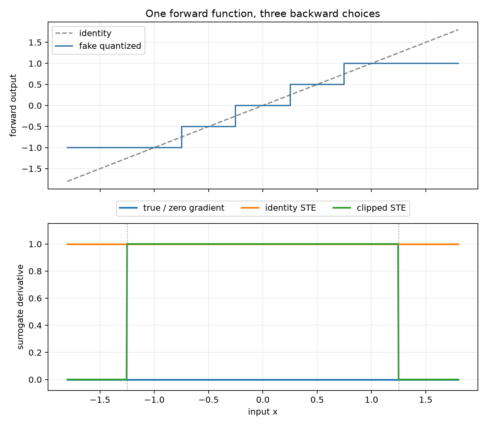
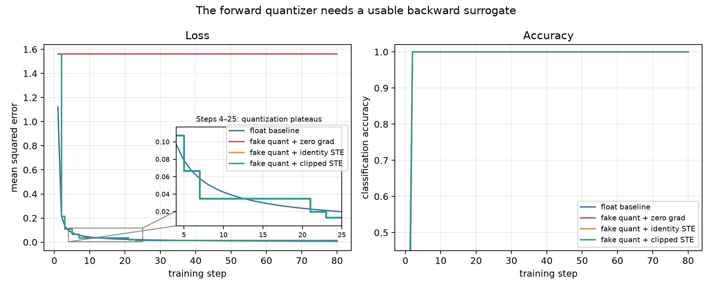

# 第 2 章、反向传播与不可导操作


在第 1 章中，我们已经把 `loss.backward()` 拆成了计算图、拓扑排序、局部导数和梯度累加。只要图中每个算子都能交出正确的局部导数，反向模式的自动微分就能把它们沿图组合起来。然而真实的 AI 系统并不只包含平滑函数：ReLU 在零点有折角，`max` 会在两个输入相等时遇到选择歧义，量化需要 `round`，生成和路由会用到离散采样或 `argmax`。这时一句“应用链式法则”还不够，因为链条中间可能根本没有可用的普通导数。

本章主要详述两个比较容易混淆的问题：第一个问题是，标量链式法则怎样推广到张量程序，框架反向传播的对象究竟是 Jacobian，还是某个更小的乘积？第二个问题是：遇到不可导或几乎处处零梯度的操作时，我们是在选择一个数学上允许的次梯度，还是主动换上一条并非真实导数的训练规则？这一区分决定了我们是在理解 autograd，还是在无意中改变优化算法。

本章配套 Notebook 位于 [02_backprop_nondifferentiable.ipynb](../code/ch02/02_backprop_nondifferentiable.ipynb)。

## 一、原理与数学推导

### 1.1 先把一条标量链算到底

我们先看一个可以在纸上自行推演的简单程序。令输入 `x=1.5`，程序依次执行：

```python
x = 1.5
u = 2 * x + 1    # u = 4
y = u ** 2       # y = 16
```

前向的数据流只有两步：

```text
x=1.5 ──▶ [u = 2x+1] ──▶ u=4 ──▶ [y = u²] ──▶ y=16
```

现在如果把 `x` 增加一个很小的量，第一步会把变化放大 2 倍，因为 $\partial u/\partial x=2$；第二步在 `u=4` 附近会把 `u` 的变化放大 8 倍，因为 $\partial y/\partial u=2u=8$。所以从 `x` 到 `y` 的总放大倍数是：
$$
\frac{\mathrm d y}{\mathrm d x}=\frac{\mathrm d y}{\mathrm d u} \frac{\mathrm d u}{\mathrm d x}=8\times2=16.
$$

因此，可以说反向传播只是按相反方向传递这个“局部变化放大倍数”：

```text
前向：x=1.5 ─────────▶ u=4 ─────────▶ y=16
反向：g_x=16 ◀── ×2 ── g_u=8 ◀── ×8 ── g_y=1
```

从输出放入 `g_y=1`，等价于从 $\partial y/\partial y=1$ 开始。经过平方节点得到 $g_u=g_y(2u)=8$，再经过仿射节点得到 $g_x=g_u\cdot2=16$。这就是标量链式法则的程序版本：每个节点只需要知道自己的局部导数，以及下游送回来的梯度。

一般地，若 $y=f(u)$、$u=g(x)$，则：

$$
\frac{\mathrm d y}{\mathrm d x}=\frac{\mathrm d f}{\mathrm d u}\frac{\mathrm d g}{\mathrm d x}.
$$

这里的乘法顺序在标量情形看不出危险，因为标量相乘可以交换。进入向量和矩阵后，维度信息自动会强迫我们把乘法顺序、或因子的转置位置等写对。

### 1.2 分支的背后是全导数

接下来，我们再给这条链添加一条分支：

$$
u=x^2,\qquad v=3x,\qquad y=u+v.
$$

在 `x=2` 时，`x` 通过两条路径影响 `y`：平方路径贡献 $2x=4$，线性路径贡献 3，总梯度为 7。

```text
          ┌──▶ [u=x²] ──▶ u ──┐
x=2 ──────┤                   ├──▶ [+] ──▶ y
          └──▶ [v=3x] ──▶ v ──┘

backward 到 x：来自上路的 4 + 来自下路的 3 = 7
```

写成微分形式就是：

$$
\frac{\mathrm d y}{\mathrm d x}=\frac{\partial y}{\partial u}\frac{\mathrm d u}{\mathrm d x}
+\frac{\partial y}{\partial v}\frac{\mathrm d v}{\mathrm d x}=1\cdot4+1\cdot3=7.
$$

因此第 1 章引擎里的 `+=` 不只是实现细节，而是多变量链式法则在程序中的落点。一个参数被卷积核共享、在残差支路复用，或同时参与正则项与任务损失时，所有路径的贡献都必须累加。反向传播并不是“沿一条链往回走”，而是在有向无环图上把所有下游伴随量汇总起来。

### 1.3 Jacobian 示例回顾

标量例子还不足以解释张量反向。考虑一个两输入、两输出的小函数：

$$
f(x_1,x_2)=\begin{bmatrix}y_1\\y_2\end{bmatrix}=\begin{bmatrix}x_1x_2\\x_1+x_2^2\end{bmatrix}.
$$

先代入 `x1=2, x2=3`。输出为 $y=(6,11)$。现在逐项计算：$y_1$ 对 $x_1$ 的敏感度是 3，$y_1$ 对 $x_2$ 的敏感度是 2，$y_2$ 对 $x_1$ 的敏感度是 1，$y_2$ 对 $x_2$ 的敏感度是 6。把它们按“输出为行、输入为列”的顺序排列：

$$
J_f(x)=\begin{bmatrix}\dfrac{\partial y_1}{\partial x_1} &\dfrac{\partial y_1}{\partial x_2}\\[6pt]\dfrac{\partial y_2}{\partial x_1} &\dfrac{\partial y_2}{\partial x_2}\end{bmatrix}=\begin{bmatrix}x_2 & x_1\\1 & 2x_2\end{bmatrix}=\begin{bmatrix}3 & 2\\
1 & 6\end{bmatrix}.
$$

这张 $2\times2$ 表就是 Jacobian。第一行描述 $y_1$ 对两个输入的敏感度，第二行描述 $y_2$ 对两个输入的敏感度；第一列则收集改变 $x_1$ 会同时怎样影响两个输出，第二列描述 $x_{2}$ 会同时怎样影响两个输出。

但训练最终需要的是标量 loss。假设后续计算在当前位置给两个输出送回上游梯度：

$$
g_y=\begin{bmatrix}\partial L/\partial y_1\\\partial L/\partial y_2\end{bmatrix}=\begin{bmatrix}4\\-1\end{bmatrix}.
$$

这相当于在局部关心 $L=4y_1-y_2$。输入梯度不是 Jacobian 本身，而是：

$$
g_x=J_f(x)^\top g_y=\begin{bmatrix}3&1\\2&6\end{bmatrix}\begin{bmatrix}4\\-1\end{bmatrix}=
\begin{bmatrix}11\\2\end{bmatrix}.
$$

也可以手算验证：$L=4x_1x_2-x_1-x_2^2$，所以 $\partial L/\partial x_1=4x_2-1=11$，$\partial L/\partial x_2=4x_1-2x_2=2$。两种方法得到同一个结果。

### 1.4 反向模式与 VJP

上一式通常称为 vector-Jacobian product（VJP）。若把梯度习惯写成行向量，形式会写成 $g_y^\top J$；本书统一把梯度写成列向量，因此使用等价的 $J^\top g_y$。记号不同，计算的是却同一组分量，关键是维度必须闭合。

假如一层有 4096 个输入和 4096 个输出，完整 Jacobian 有一千六百多万个元素；一个大型模型的整图 Jacobian 更不可能显式构造。反向引擎做的是逐算子 VJP：矩阵乘法利用矩阵结构，逐元素函数利用逐元素导数，广播在反向时沿扩张轴求和。它只计算当前 loss 方向真正需要的乘积。

两层向量函数 $x\mapsto u\mapsto y\mapsto L$ 的数据流可以写成：

```text
forward:
x ─────────▶ u=f(x) ─────────▶ y=h(u) ─────────▶ L

backward (VJP):
g_x=J_fᵀg_u ◀── g_u=J_hᵀg_y ◀──  g_y=∂L/∂y  ◀──  1
```

组合后得到 $g_x=J_f^\top J_h^\top g_y=(J_hJ_f)^\top g_y$，正好对应复合函数 Jacobian 的链式法则。第 1 章实现的 `Tensor.backward(seed)` 中，`seed` 就是最右侧的上游向量；输出为标量时它退化为 1。

如果矩阵乘法仍显得抽象，可以把上面的两输入函数逐分量写一次。令最终目标 $L=4y_1-y_2$，那么 $\partial L/\partial y_1=4$、$\partial L/\partial y_2=-1$。对任意输入分量 $x_j$，链式法则都要枚举所有输出路径：

$$
\frac{\partial L}{\partial x_j}=\sum_{i=1}^{2}\frac{\partial L}{\partial y_i}\frac{\partial y_i}{\partial x_j}.
$$

对 $x_1$，两条路径给出 $4\times3+(-1)\times1=11$；对 $x_2$，给出 $4\times2+(-1)\times6=2$。$J^\top g_y$ 只是把这两次“遍历输出并累加路径”的计算打包成矩阵记号。理解这一点后，VJP 就不再像凭空多出的术语：它正是分支梯度累加在向量函数上的批量表达。

再向一般情形推广，若 $x\in\mathbb R^n$、$u=f(x)\in\mathbb R^m$、$y=h(u)\in\mathbb R^p$，则 $J_f$ 的形状为 $m\times n$，$J_h$ 为
$p\times m$。前向复合 Jacobian 是 $J_hJ_f$，形状为 $p\times n$；反向从 $g_y\in\mathbb R^p$ 出发，先计算 $J_h^\top g_y\in\mathbb R^m$，再计算 $J_f^\top g_u\in\mathbb R^n$。每经过一层，伴随量的形状恰好变成该层输入的形状。

这也解释了为什么神经网络训练偏爱反向模式。模型参数可能有数十亿个，即输入维度 $n$ 极大，但一次训练的最终 loss 通常只有一个标量，即 $p=1$。反向模式用一次从标量出发的反向遍历得到所有参数梯度；如果逐参数使用反向模式，就要为大量输入方向分别传播。这里说的是复杂度结构上的优势，并不意味着前向模式没有用途：当输入方向很少、输出很多，或需要 JVP 时，前向模式可能更合适。

### 1.5 “不可导”至少包含三种不同问题

在反向传播中，如果所有操作都有光滑的函数曲线，则一切万事大吉，可如果某个局部算子不能提供 Jacobian，VJP 链条怎么办？“不可导”往往与三类性质完全不同的问题有关：

第一类是**只在少数点有折角**。例如 $|x|$、ReLU 在零点不可导，但在其他位置都有普通导数。对 ReLU 而言：

$$
\operatorname{ReLU}(x)=\max(0,x),\qquad\frac{\mathrm d}{\mathrm d x}\operatorname{ReLU}(x)=
\begin{cases}0,&x<0,\\1,&x>0.\end{cases}
$$

在 $x=0$ 处左右导数不同，框架必须选定一个约定。PyTorch 对局部凸函数优先选择**最小范数次梯度**，因此 ReLU 在零点返回 0。这个选择让程序拥有确定语义，却没有篡改 ReLU 在其余位置的导数。连续分布下恰好落在一个孤立点的概率通常很小，所以这类折角并不会自动阻断整个训练。

> 关于次梯度，直观的理解是，在不可导点，画一条直线，要求原函数的值不小于直线上的值，以 ReLU 在零点为例，穿过零点且函数值不大于 ReLU 值的直线斜率在 $[0, 1]$ 区间内，即该区间内任意值均可以作为 ReLU 在零点的次梯度。

因此，有不可导点并不等于无法使用梯度下降，真正应该关心的是，不可导区域到底有多大？它是否让梯度长期失去信息？这就引出了第二类。

第二类是**分段常数操作**，典型代表是 `round`、硬阈值和 `argmax`。以四舍五入为例：

$$
q(x)=\operatorname{round}(x).
$$

只要 $x$ 还在同一个量化格内，稍微移动它，输出完全不变，例如 $x \in [1.5, 2.5)$ 时，整个区间内容都有$q(x)=2$，因此在该区间内导数几乎处处为 0；在半整数跳变点处，如 $x=1.5, 2.5,3.5, \cdots$，导数又不存在。它不是“只有一个点需要选次梯度”，而是几乎整个定义域都不给梯度下降提供方向。所以：

$$
q'(x)=\begin{cases}0,&\text{几乎处处}\\\text{不存在},&\text{跳变点}\end{cases}
$$

这就比 ReLU 严重得多，几乎全区域无法给出有效梯度，优化器也就无法根据梯度信息更新参数，这会导致模型训练严重受阻。

第三类是**离散随机节点**。例如 $z\sim\operatorname{Categorical}(p_\theta)$ 时，一次具体采样结果不是参数到输出的普通确定函数。例如，$p_\theta=[0.2,0.3,0.5]$，第一次采样可能得到 $z=2$，下一次采样可能得到 $z=0$，其输出结果是概率性而不是确定性的。所以此处甚至不能简单的求解 $\mathrm{d}z / \mathrm{d}\theta$，一次采样并没有普通确定函数意义上的 $z=f(\theta)$。

因此真正可能可导的是期望 $\nabla_\theta\mathbb E_{z\sim p_\theta}[L(z)]$，例如假设：$z\in\{0,1\}$，且 $z\sim\operatorname{Bernoulli}(p)$，损失函数为：

$$L(z)=\begin{cases}0,&z=0\\10,&z=1.\end{cases}$$
那么期望损失可表示为：$\mathbb E[L]=(1-p)\cdot0+p\cdot10=10p$，所以有 $\frac{\mathrm{d}}{\mathrm{d}p}\mathbb E[L]=10$，即单个采样路径不可普通求导，但采样分布对应的期望可能完全可导。

此外也可以用 score-function/REINFORCE、连续松弛或其他估计器处理进行处理。例如我们的目标是 $\nabla_\theta\mathbb E_{z\sim p_\theta}[L(z)]$，将其展开为 $\mathbb E[L]=\sum_z p_\theta(z)L(z)$，对其求导可得 $\nabla_\theta \mathbb E[L]=\sum_z L(z)\nabla_\theta p_\theta(z)$。然后利用恒等式：$\nabla_\theta p_\theta(z)=p_\theta(z)\nabla_\theta\log p_\theta(z)$ 得到：$\nabla_\theta \mathbb E[L]=\sum_z p_\theta(z) L(z) \nabla_\theta\log p_\theta(z)$，也就是：

$$\boxed{\nabla_\theta \mathbb E[L]=\mathbb E[L(z)\nabla_\theta\log p_\theta(z)]}$$
这就是 score-function estimator / REINFORCE 的核心。

我们将上述三类问题总结如下：

```text
孤立折角：        连续输入 ─▶ ReLU/max ─▶ 连续输出
                  大多数位置有真导数；折角处需框架约定

分段常数：        连续输入 ─▶ round/argmax ─▶ 离散或网格化输出
                  几乎处处真导数为 0；梯度链长期失去信号

随机离散节点：    参数 θ ─▶ 分布 pθ ─▶ sample z ─▶ loss
                  目标通常是期望梯度，需要梯度估计器
```

本章正文聚焦第二类中的量化，因为它把问题展示得最干净，也对应成熟的 Quantization-Aware Training（QAT）工程实践。离散随机变量的估计器作为拓展阅读供感兴趣的读者进一步阅读理解。

### 1.6 为什么小扰动和“真实梯度”救不了 round

我们通过具体示例演示，令 $x=0.74$、量化步长 $s=0.5$。对称伪量化先除以步长、取整、截断，再乘回步长：

$$
Q(x)=s\cdot\operatorname{clip}\left(\operatorname{round}\left(\frac{x}{s}\right),q_{\min},q_{\max}\right).
$$

代入数字：

$$
\frac{0.74}{0.5}=1.48,\qquad\operatorname{round}(1.48)=1,\qquad Q(0.74)=1\times0.5=0.5.
$$

这个函数实际上是“楼梯”状，因为步长 $0.5$，所以函数类似：

```text
Q(x)

1.5 |                       ┌────────
    |                       │
1.0 |             ┌─────────┘
    |             │
0.5 |   ┌─────────┘
    |   │
0.0 |───┘
    +-------------------------------- x
       0.25      0.75      1.25
```

有限差分的想法是，如果不知道解析导数 $Q'(x)$，可以用
$$
Q'(x) \approx \frac{Q(x+\epsilon)-Q(x-\epsilon)}{2\epsilon}.
$$
进行计算，例如用 $\epsilon=10^{-4}$ 做中心差分，`0.7399` 和 `0.7401` 仍落在同一格，两边输出都是 `0.5`：

$$
\frac{Q(0.7401)-Q(0.7399)}{2\times10^{-4}}=\frac{0.5-0.5}{0.0002}=0.
$$

把 $\epsilon$ 继续减小并不会更好，因为这一格内部的函数本来就是常数。若差分区间刚好跨过跳变点，分子突然出现一个量化步长，商会随 $\epsilon$ 变小而爆大；这也不是稳定的局部方向。有限差分忠实揭示了阶梯函数的性质，却无法凭空制造适合梯度下降的信号。

假设损失为 $L=(Q(w)-t)^2$。按真实的几乎处处导数：

$$
\frac{\partial L}{\partial w}=2(Q(w)-t)\frac{\partial Q}{\partial w}=0.
$$

即使当前预测离目标很远，参数也无法有效更新。这不是 autograd 出错，而是我们把一个依赖连续梯度的优化器用在了分段常数目标上。

因此，这里的核心是在回答一个很自然的问题：既然 `round` 的解析导数几乎处处为 0，那我们能不能不用 autograd，而是自己给参数加一个很小的扰动，用有限差分“探测一下方向”？答案是：**不行。因为有限差分并不会修复 `round`，它只会忠实地表明：这个函数局部确实是平的**。而如果把扰动放大到足以跨过量化边界，得到的又不再是稳定的“局部梯度”。

### 1.7 STE：前向说真话，反向提供替代方向

直通估计器(Straight-Through Estimator, STE) 的做法非常直接：前向仍执行真正想模拟的离散操作，反向却不使用它的真实导数。最简单的 identity STE 定义为：

$$
\hat y=Q(x)\quad\text{(forward)},\qquad \frac{\widetilde{\partial \hat y}}{\partial x}=1 \quad\text{(backward)}.
$$

举例而言，假设 $s=0.5, x=0.74$，前向计算完全遵从量化规则，$Q(0.74)=0.5$，真实导数几乎处处有 $\frac{\partial Q}{\partial x}=0$，而人为规定 $\frac{\widetilde{\partial Q}}{\partial x}=1$，保证此处梯度可以直接穿过去，这也是其名字“直通估计器”的直观解释。

此处的波浪号是有意为之，以区别真实导数：即这里传播的是替代梯度 (surrogate gradient)，不是 $Q$ 的经典导数。若下游给出 $g_{\hat y}$，反向闭包直接复制：

$$
g_x\leftarrow g_x+g_{\hat y}\left(\times \frac{\widetilde{\partial \hat y}}{\partial x}=1\right)=g_{x}+g_{\hat y}.
$$

于是上一小节的损失得到替代梯度 $\widetilde{\partial L/\partial w}=2(Q(w)-t)$，参数终于能移动。移动仍发生在浮点主参数上；当它跨过某个量化格边界时，下一次前向的 $Q(w)$ 才会跳到新值。训练因此是“连续的影子参数驱动离散前向”而不是直接对整数做梯度下降。

影子参数是什么意思？QAT 并不是直接优化整数权重（整数参数无法表示有效的微小更新），而是始终保存一个真正可训练的浮点参数，例如 $w=0.74$，该参数就是影子参数（shadow parameter），这个浮点参数每次 `optimizer.step` 都可以发生细微变化。但由于 forward 使用的是 $Q(w)$，所以网络真正看到的情景类似：

```text
w                  Q(w)

0.740 ───────────▶ 0.5
0.744 ───────────▶ 0.5
0.748 ───────────▶ 0.5
0.752 ───────────▶ 1.0
0.756 ───────────▶ 1.0
```

于是这里同时存在两个世界：

```text
       参数世界                    前向世界

   连续浮点参数 w              离散/量化后的 Q(w)

      0.740                         0.5
        ↓                           │
      0.745                         0.5
        ↓                           │
      0.749                         0.5
        ↓                           │
      0.751 ─────────────────────▶  1.0
```

这就是连续的影子参数驱动离散前向计算过程。

需要注意的是，identity STE 有个明显问题：输入早已超出可表示范围、前向被 clamp 到端点后，它仍然传梯度。参数可能继续向区间外漂移，但前向结果完全不再变化。

例如 $s=0.5, q_{\min}=-2, q_{\max}=2$，其只能表示整数码 $-2,-1,0,1,2$，对应反量化值 $-1,-0.5,0,0.5,1$。这会导致 $x$ 的取值从 $1.5$ 增加到 $2, 5 10, 100, 1000$ 等过程中，$Q(x)$ 始终是 1，forward 已经彻底不关心 $x$ 继续增大了，然 identity STE 却仍然给它梯度 1，这就存在一个问题，forward 明明已经饱和了，但 backward 却假装输入变化仍然会线性影响输出。

一个常见变体是 clipped STE：

$$
\frac{\widetilde{\partial Q(x)}}{\partial x}=\mathbf 1\{q_{\min}\le \operatorname{round}(x/s)\le q_{\max}\}.
$$

在未饱和区域传 1，整数码越界时传 0。这更接近 PyTorch fake-quant 算子的反向 mask。注意判断对象是 **clamp 前、round 后的整数码**。例如 `scale=0.5`、码域 `[-2,2]` 时，`x=1.24` 有
`round(2.48)=2`，仍传梯度；`x=1.26` 有 `round(2.52)=3`，梯度被截断，此处梯度值为 0，无法通过。需要注意的是，此处不能简单把 mask 写成 $|x|\le q_{\max}s=1$。

无论 identity 还是 clipped，STE 一般都是有偏估计。它的价值不是“恢复了正确导数”，而是给优化器一个经验上有用、计算便宜且已被大量量化训练系统采用的方向。这个表述边界非常重要：如果把 STE 当数学恒等式，后面就无法解释不同 surrogate gradient 为什么会产生不同训练轨迹。

关于 STE，我们可以总结如下：

1. STE 并未声称 $round'(x)=1$ 而是训练时人为使用 $\widetilde{round'(x)}=1$
2. forward 模拟部署时真正的量化误差，backward 则人为提供可学习方向。
3. 真正被 SGD 更新的是连续浮点“影子参数”，不是离散整数码。
4. STE 的成功标准不是“梯度数学上有多真实”，而是这种替代方向最终能否训练出更好的真实量化模型。

#### 1.7.1 STE 工作机制示意图

```text
                FP32/BF16 shadow weight
                        w = 0.74
                           │
                           │
                 ┌─────────┴─────────┐
                 │                   │
              forward             backward
                 │                   │
                 ▼                   ▲
              Q(w)                STE rule
                 │                   │
            round/clamp              │
                 │                   │
                 ▼                   │
               0.5                   │
                 │                   │
                 ▼                   │
              network                │
                 │                   │
                 ▼                   │
               loss ───── gradient ──┘
                 │
                 │
                 ▼
              optimizer
                 │
                 ▼
              w = 0.75...
                 │
                 ▼
       下一次 forward 跨量化格
                 │
                 ▼
            Q(w): 0.5 → 1.0
```

它实际上是一个循环：

$$
\boxed{
\text{浮点参数}
\xrightarrow{\text{真实量化 forward}}
\text{离散网络行为}
\xrightarrow{\text{surrogate backward}}
\text{浮点梯度}
\xrightarrow{\text{optimizer}}
\text{新浮点参数}
}
$$

这就是 QAT 的核心训练机制。

#### 1.7.2 有偏究竟偏在哪里

何谓“无偏”、“有偏”，举个直观的例子，如果真实梯度为 3，估计器多次给出的梯度尽管可能并不等于 3，但均值为 3，即 $\mathbb E[\hat g]=g$，这就是无偏的，否则为有偏估计。

仍令 $L(w)=(Q(w)-t)^2$，以及 $w=0.74, Q(w)=0.5,t=1$，则真实梯度值为 0，而估计值为 -1。真实量化目标关于 $w$ 是阶梯状的：格内完全平坦，跨格时突然跳变。identity STE 返回的 $2(Q(w)-t)$ 通常不等于 $\mathrm dL/\mathrm dw$，也不是通过减小有限差分步长就会逼近的量。因此“有偏”不是数值误差，而是估计量的期望或取值与目标真梯度系统性不同。

这并不意味着它毫无信息，例如此处 SGD 执行更新 $w\leftarrow w-\eta(-1)$，所以 $w$ 会增大，这恰好会把 $w$ 
往右边的量化格推：

```text
Q = 0.5                         Q = 1.0

──────────────┐             ┌────────────
              │             │
      w ──────┼────────────▶│
              │             │
            boundary
```

一旦跨过去 $Q(w):0.5\rightarrow1$，损失值从 $(0.5-1)^2=0.25$ 变成 $(1-1)^2=0$。

所以若当前 $Q(w)$ 小于目标 $t$，替代梯度的符号会推动浮点影子参数向更大的量化格移动；一旦越过边界，前向损失确实可能下降。换句话说，STE 利用连续空间中的方向感，帮助参数搜索离散网格上的较好位置。这个直觉在一维很清楚，但深网络中层与层之间相互作用，替代方向不保证每一步都降低真实量化目标，也不保证与任何光滑标量目标的精确梯度完全一致。

所以成熟工程不会因为“用了 STE”就停止验证。至少要观察训练 loss、量化后验证指标、梯度范数、饱和比例和最终转换模型；还要把不同随机种子、量化启用日程和 scale 方案纳入实验。STE 解决的是“没有可用局部信号”的第一道门槛，不是对收敛质量的担保书。

identity 与 clipped 也体现了典型偏差选择。identity 在区间外仍提供方向，信号密集但可能推动无效漂移；clipped 与 fake-quant 饱和行为更一致，却可能制造死区。没有脱离模型、初始化和量化参数的绝对胜者。框架的默认规则可以作为可靠起点，最终选择仍要由转换后指标支持。

### 1.8 从整数码到伪量化

生产量化通常采用仿射映射，比如 INT8 只有 256 个整数，怎样用这些整数近似表示浮点数？真实数 $r$ 与整数码 $q$ 的近似关系为：

$$
r\approx s(q-z),
$$

其中 $s>0$ 是 scale，$z$ 是零点位置（zero point）。可以把它理解成，$q$ 不是实际数值本身，而是一个“格子编号”，而 $s$ 决定每两个格子之间隔多远。比如：$s=0.5,z=0$ 那么有：

```text
整数码：           -2    -1     0     1     2
对应浮点网格：      -1   -0.5    0    0.5    1
```

这就是所谓的量化网格（quantization grid）。$s=0.5$ 意味着相邻两个可表示实数之间相差 0.5。因此只能精确表示 $\dots,-1,-0.5,0,0.5,1,\dots$，而像 $0.74$ 并不在网格上，就必须把它吸附到最近的格子。所以 $0.74 \rightarrow0.5$，而 $0.76 \rightarrow1.0$，这其实就是量化误差产生的地方。

完整量化其实有量化（$r\rightarrow q$）与反量化（$q\rightarrow\hat r$）两个阶段，其组合为：

$$
q=\operatorname{clip}\left(\operatorname{round}\left(\frac r s\right)+z,q_{\min},q_{\max}\right),\qquad \hat r=s(q-z).
$$

本节实现固定 $z=0$，也就是对称 per-tensor 量化。这样可以把注意力集中在不可导前向和反向规则上；怎样根据观测范围选择 scale、非零 zero point、per-channel 参数和校准统计，会在第 47 章完整展开。

一般来说 $\hat{r} \neq r$，如 $r=0.74$ 经量化后 $q=1$，而反量化加过为 $\hat r=0.5\times1=0.5$。

所以一个很自然的问题是，既然已经得到了 $q=1$，为什么不直接拿整数 1 去训练，还要量化回浮点数？这是伪量化（fake quantization）最核心的问题。因为训练期间我们通常仍希望使用普通浮点神经网络运算。伪量化做的是 $0.74 \rightarrow 1 \rightarrow 0.5$，其数据类型依旧可能是 `float32` / `bfloat16`，但它只能取量化网格上的数值，只是数值模拟了量化后的结果。也就是 QAT 数据流在训练阶段和真正部署阶段处理方法并不一致：

```text
训练时（浮点存储与计算）
浮点类型主权重（0.74） ─▶ 伪量化 ─▶ 浮点类型网格值（0.5） ─▶ 矩阵乘法 ─▶ 损失值
       ▲                                                          │
       └───────────────────────── 替代梯度 ◀───────────────────────┘

部署转换后（真正低精度表示/算子）
浮点类型训练后权重（0.74） ─▶ 量化 + pack ─▶ 整数权重（1） ─▶ 整数计算核
```

所以训练时并没有真的把所有权重永久变成 INT8、使用真正的 INT8 GEMM，也没有用整数 optimizer 更新参数。它只是让前向计算看到与量化部署类似的舍入误差、裁剪、包河区以及离散网格等。

那伪量化的目的何在呢？假设不做 QAT，训练时网络一直看到 $w=0.74$，然后部署突然 $0.74\rightarrow0.5$，网络从来没见过这种误差，性能可能会下降。而 QAT 的目的就是在训练阶段就让网络看到这种量化过程，是网络在训练过程中可以逐渐适应“未来的权重和激活都会被舍入处理”。所以 QAT 的思想不是把训练真的变成整数计算，而是让训练提前暴露在量化误差中，然后让参数自行适应。

我们再用几个相邻数字观察完整前向。仍取 $s=0.5$、码域 `[-2,2]`：

| 输入 $x$ | $x/s$ | round 后整数码 | clamp 后整数码 | 反量化输出 |
| -----: | ----: | ---------: | ---------: | ----: |
|  -1.26 | -2.52 |         -3 |         -2 |  -1.0 |
|  -1.24 | -2.48 |         -2 |         -2 |  -1.0 |
|  -0.24 | -0.48 |          0 |          0 |   0.0 |
|   0.74 |  1.48 |          1 |          1 |   0.5 |
|   1.24 |  2.48 |          2 |          2 |   1.0 |
|   1.26 |  2.52 |          3 |          2 |   1.0 |
|        |       |            |            |       |

注意 `-1.26` 与 `-1.24` 的最终前向都等于 `-1.0`，但 clipped backward 不同：前者的原始整数码已经越界，mask 为 0；后者仍在码域内，mask 为 1。只保存 clamp 后结果就无法区分这两种历史，因此实现额外保留 `integer_codes`。这也是 autograd 算子常在 forward 保存 backward 所需中间量的具体例子。

如果训练时直接把主参数转换成整数 Tensor，整数本身通常不参与 autograd，优化器也失去用于累积微小更新的浮点状态。fake quantization 的关键不是“先转整数再转回来”这句表面操作，而是同时保留浮点主参数、量化噪声前向和人工定义的反向通道。

最后我们可以将伪量化的处理过程总结为：

$$
\boxed{
w_{\text{FP master}}
\xrightarrow[\text{forward}]{\text{round+clamp}}
q_{\text{integer code}}
\xrightarrow{\text{dequantize}}
\hat w_{\text{FP grid}}
\xrightarrow{\text{network}}
L
\xrightarrow[\text{backward}]{\text{STE}}
w_{\text{FP master}}
}
$$

伪量化的“伪”，是指我们并没有真的把训练计算切换成整数硬件执行。


### 1.9 PTQ、QAT 与 STE 的关系

Post-Training Quantization（PTQ）在模型训练完成后估计量化参数并转换权重，通常不需要对 `round` 反传；QAT 则在训练或微调阶段把 fake-quant 节点插入图中，让模型提前适应量化误差。两者的主要区别在于：PTQ 成本低，通常应先尝试；当目标位宽、模型敏感度或精度要求使 PTQ 损失不可接受时，QAT 用额外训练成本换恢复空间。

| 路线   | 训练前向是否模拟量化             | 是否需要穿过 round 的梯度 | 主要代价           |
| ---- | ---------------------- | ---------------- | -------------- |
| 浮点训练 | 否                      | 否                | 部署前尚未暴露量化误差    |
| PTQ  | 否                      | 否                | 校准与转换后可能有精度损失  |
| QAT  | 是，使用 fake quantization | 是，通常使用 STE       | 训练更慢、图更大、超参数更多 |

STE 也不等于 QAT。STE 是一种反向梯度估计规则；QAT 是包含量化方案、observer/scale、fake-quant 插入位置、训练日程和最终转换在内的完整流程。一个系统可以在硬二值门控中使用 STE 而与量化无关，也可以研究不用最朴素 STE 的量化优化方法。把两者画等号，会把局部 backward 技巧误当成整个部署方案。

一条更完整的 QAT 生命周期通常包含四段：

1. 第一段从浮点模型出发，确定目标 backend 支持的权重/激活位宽、对称或仿射方案以及 per-tensor/per-channel 粒度。
2. 第二段插入 observer 与 fake-quant 节点：observer 用于观察 Tensor 的数值范围，然后估计量化参数，主要用于收集范围统计，如 $x_{\min},x_{\max}$；fake quantizer 使用当前 qparams 模拟数值。
3. 第三段进行训练或微调，并可能在合适时机冻结 observer，否则模型不仅要适应参数更新，还要追赶不断变化的量化规则，这可能会导致训练不稳定，此外还有延迟启用量化（训练早期，参数随机性较大，激活不稳定，过早量化可能会导致训练困难）或固定 BatchNorm 统计（量化部署时，很多 backend 最终会把 $\text{Conv + BatchNorm}$ 进行折叠，即把 BN 参数折叠到 Conv 权重里。如果训练期间 BN 统计不断变化，那么对应的有效量化分布也不断变化）。
4. 第四段转换模型，把训练图中的模拟节点替换为真实量化、打包和目标 kernel 能消费的结构。

这四段中，STE 只发生在第三段某些 fake-quant 节点的 backward。observer 什么时候停止更新、激活是否动态量化、bias 用何种累加精度、哪些层保留高精度，都不是 identity derivative 能回答的问题。可见模型 QAT 效果不好时，原因可能是校准、插入位置或部署不匹配，而不一定是 STE 公式本身。

同时，QAT 不是免费获得部署收益。训练图会新增 fake-quant 运算和中间 Tensor，速度与内存可能变差；真正的低精度加速只有转换后命中合适硬件 kernel 才会出现。PyTorch 和 TensorFlow 的成熟流程都把“训练模拟”与“部署转换”分成独立阶段，正是为了让数值适应与执行优化各自可验证。

### 1.10 `argmax` 相关的最大索引需求处理方法

作为分段函数，既然 `round` 可以用 STE 假装 backward 是 identity，那对于 `argmax` 能不能也这么做？答案是：**不能直接照搬。** 因为 `round` 和 `argmax` 虽然都有“分段常数”这个共同点，但它们的**输入输出空间完全不同**。而 `max` 又是第三种情况。

假设 $x=[0.2,1.7,1.6]$，那么 $\operatorname{argmax}(x)=1$，它返回的是最大元素所在的位置索引，所以它的映射实际上是 $\operatorname{argmax}: \mathbb R^3\rightarrow\{0,1,2\}$。在这种情况下输入即使发生小变化，只要第二个分量仍最大，索引就不变，所以它和 `round` 一样是局部分段常数。更麻烦的是，索引空间与输入向量空间的形状和语义都不同：“把上游梯度原样复制给三个 logits” 不仅没有自然的维度解释，实际上也不可行，因为 `argmax` 真正关心的是 logits 之间的相对大小，因此三个值同时增加或减小，可能并不改变其相对大小。

与之相关但不同的 `max` 操作返回最大值 1.7；在最大值唯一时，它可以自然的把梯度传给被选中的第二个输入，其他位置为零，但两项并列时仍需规定怎样分配。这说明“包含硬选择”并不自动决定 backward：要看输出是值还是索引、局部映射是什么、训练目标又需要什么。

同 softmax 相比，`argmax` 的简单粗暴，完全丢失了细节信息，这也是为什么分类训练通常不会选择 $\text{logits}\rightarrow \operatorname{argmax} \rightarrow \text{loss}$，而是直接 $\text{logits}\rightarrow\text{cross entropy}$。因此若任务在训练阶段需要近似离散类别选择，常见路线包括：

* softmax 温度松弛，把 softmax 加一个温度：
$$
p_i(\tau)=\frac{\exp(x_i/\tau)}{\sum_j\exp(x_j/\tau)}.
$$
其中 $\tau>0$，当 $\tau$ 比较大时，分布比较平滑，如 `[0.2, 1.7, 1.6] -> [0.20, 0.41, 0.39]`，当 $\tau$ 减小时，最大元素越来越突出 `→ [0.01, 0.55, 0.44]`。但尽管进一步降低温度，形式上会更接近 `argmax`，但此时梯度信息更加困难，因此不能将温度简单的降到 0。
* Gumbel-Softmax：并不是单纯选中最大 logit，而是做：$z\sim\operatorname{Categorical}(p_\theta)$，即随机抽取类别。由于普通的类别采样是离散随机节点，不能直接做路径微分。该方法的思路是应用 Gumbel-Max 技巧，从类别分布中采样，等价于给每个类别的 logit 加独立 Gumbel 噪声，然后取 `argmax`，随后进一步将 `argmax` 委托给上述 softmax 温度松弛计算方法：

$$
y_i=\frac{\exp((\log p_i+g_i)/\tau)}{\sum_j\exp((\log p_j+g_j)/\tau)}.
$$
* 带 hard forward 的直通变体，类似 STE 一样前向真实的产生 one-hot，例如 `[0.1,0.6,0.3] -> [0,1,0]`，反向时却沿 soft probabilities 的梯度传播。如果你看过 [PyTorch 关于 gumbel-softmax](https://docs.pytorch.org/docs/2.14/generated/torch.nn.functional.gumbel_softmax.html)，你会看到其中有关 hard 技巧的经典编码方式：

	```python
	y = y_hard - y_soft.detach() + y_soft
	# forward：`detach()`  的值仍然存在，所以 y = y_hard - y_soft + y_soft = y_hard
	# backward: y_hard 不传梯度，y_soft.detach() 不传梯度，只有 y_soft 传播梯度
	# 这就是 hard forward / soft backward 的 STE
	```

* 得分函数估计器 REINFORCE，见 1.5 章节。

但这些方法优化的对象，偏差—方差特性不同，以直通估计器为例，往往偏差较大，但方差小，梯度训练相对稳定，而经典的得分函数估计器可以做到无偏，但通常方差较大，训练信号可能非常嘈杂。

因此这里最重要的工程习惯不是记住一个万能写法，而是需要先考虑：**真实目标是确定性离散函数，还是随机变量下的期望？是否允许有偏？部署时必须 hard 到什么程度？**

关于上述几种操作的区别，我们可以总结如下：

| 操作               | 输入   | 输出           | 核心性质             | backward                |
| ---------------- | ---- | ------------ | ---------------- | ----------------------- |
| `max(x)`         | 连续向量 | 连续标量         | 选择最大**值**        | 唯一最大时梯度传给 winner        |
| `argmax(x)`      | 连续向量 | 离散索引         | 选择 winner **身份** | 几乎处处无有用真实梯度             |
| `softmax(x)`     | 连续向量 | 连续概率向量       | 平滑竞争             | 正常 Jacobian             |
| `Categorical(p)` | 概率   | 随机离散样本       | 随机选择             | 需要期望梯度估计                |
| hard 直通变体        | 连续向量 | hard one-hot | hard forward     | surrogate/soft backward |

### 1.11 为不可导算子设计 backward 的判断顺序

经过前面几个小节的讲述，那当我们遇到任何新的不可微分操作，应该怎样系统地设计它的反向传播，而不是看到不可导就条件反射地写 STE：

1. 第一步应当先明确输出语义：输出是连续值、离散索引，还是来自某个概率分布的样本。形象的说，“不可导”只是症状，不是诊断结果，必须先弄清楚问题属于哪种疾病。
2. 第二步找出不可导集合：只有孤立折角，还是大范围分段常数？
3. 第三步明确真正优化的标量目标：是单次确定性 loss，还是对随机性的期望？
4. 第四步才选择处理方式，并把偏差、方差和部署一致性写进合同。

以上步骤可以整理成如下结构树：

```text
                         新的硬操作算子
                               │
                               ▼
                        输出究竟是什么语义？
                               │
                               ▼
                    是否存在普通且有用的局部梯度？
                       /                \
                     是                  否
                     │                    │
                 使用真实导数               ▼
                折角处规定惯例           为什么没用？
                                  ┌───────┴────────┐
                                  │                │
                             确定性硬映射        随机性离散节点
                                  │                │
                        松弛 / STE / 改写目标   先定义期望 E[L]
                                                   │
                                                   ▼
                                          REINFORCE / 松弛等估计器
```

选定替代梯度后，forward 和 backward 必须作为两个独立合同测试。forward 主要测试它是否忠实模拟部署语义，例如舍入、截断、tie-breaking 与输出 dtype；backward 则测试任意上游 seed 下的 VJP、mask 边界、广播回收和多路径累加。不要用“训练 loss 最后下降了”替代单元测试，因为更下游的可训练旁路可能掩盖一个完全失效的自定义梯度。

还要明确高阶梯度。一个自定义 backward 本身若由可微 Tensor 运算构成，框架可能允许再次求导；若 backward 返回手工数组或 detach 结果，高阶导数可能被截断。STE 的一阶规则已经不是原函数真导数，对它继续求二阶导时语义更需要单独定义。本章只承诺一阶训练 VJP，不声称 identity/clipped STE 的 Hessian 对原量化目标有经典二阶意义。

最后，把选择写进名字。`fake_quantize(..., grad_mode="clipped")` 比一个表面叫 `round`、暗中把梯度改成 1 的方法更诚实。调用者一眼就能看出前向数值与反向估计是两层决策；代码审查者也能针对替代梯度的适用性提问，这种显式性在大型训练系统里尤为重要。

同样的原则也适用于实验记录。报告结果时应同时写出前向硬操作、反向估计器、量化参数和启用日程；只写“采用量化训练”不足以复现实验。两个模型即使位宽相同，只要 scale 粒度或饱和 mask 不同，优化过程就已不是同一个算法。

## 二、从零手写实现

### 2.1 文件边界与复用方式

第二章的代码文件主要引用第一章中已经通过广播、VJP 和拓扑测试的 `Tensor` 结构，如 `code/ch02/quantization.py` ，并只新增一个算子节点；`experiment.py` 负责数据与训练；`plot_ch02.py` 只消费实验结果，代码关系如下：

```text
code/ch01/tensor.py
        │ 提供 Tensor、_add_grad、backward
        ▼
code/ch02/quantization.py ──▶ fake_quantize / torch_identity_ste
        │
        ▼
code/ch02/experiment.py ─────▶ 可复现训练轨迹
        │
        ▼
code/ch02/plot_ch02.py ──────▶ assets/ch02/*.png
```

量化函数返回两个值：fake-quantized 浮点数组，以及 clamp 前的整数码，clipped backward 正是基于此判断前向是否饱和：

```python
def quantize_dequantize(
    values: np.ndarray,
    scale: float,
    qmin: int,
    qmax: int,
) -> tuple[np.ndarray, np.ndarray]:
    integer_codes = np.round(np.asarray(values, dtype=np.float64) / scale)
    fake_quantized = np.clip(integer_codes, qmin, qmax) * scale
    return fake_quantized, integer_codes
```

NumPy 的 `round` 和本章 PyTorch 对拍环境均采用 round-to-nearest-even，即常见的 banker's rounding。测试特意避开大部分恰好位于 `.5` 的输入；真正部署时仍应以目标 backend 的 rounding 规则为准。

### 2.2 一个节点，两套语义

核心 `fake_quantize` 的前向不因 `grad_mode` 改变：

```python
data, integer_codes = quantize_dequantize(tensor.data, scale, qmin, qmax)
output = Tensor(
    data,
    (tensor,),
    f"fake_quant[{grad_mode}]",
    requires_grad=tensor.requires_grad,
)
```

换句话说，三组实验看到完全相同的量化网格。区别全部封装在局部 VJP 闭包中：

```python
def _backward() -> None:
    if grad_mode == "zero":
        return
    if grad_mode == "identity":
        tensor._add_grad(output.grad)
        return
    mask = (integer_codes >= qmin) & (integer_codes <= qmax)
    tensor._add_grad(output.grad * mask)
```

`zero` 什么都不累加，模拟阶梯函数几乎处处为零的真实导数；`identity` 把上游 VJP 原样交给输入；`clipped` 先乘布尔 mask。最后仍调用第 1 章的 `_add_grad`，以适应未来输入通过广播参与更大表达式，形状回收和多路径累加规则等均已实现。

入口还会拒绝 `scale<=0`、无限 scale、颠倒的整数边界以及未知 `grad_mode`。这些检查可以防止错误参数产生除零、NaN 或静默选择某种反向规则，使实验失去解释性。

### 2.3 detach-trick 的代数拆解

在 PyTorch 中，identity STE 常写成一行：

```python
quantized = (tensor / scale).round().clamp(qmin, qmax) * scale
return tensor + (quantized - tensor).detach()
```

我们可以把它分成前向与反向两个路径。前向时 `detach()` 不改变数值：

$$
x+\operatorname{stopgrad}(Q(x)-x)=x+Q(x)-x=Q(x).
$$

反向时 `stopgrad` 内部整条支路的梯度为零，只有外面 $x$ 的梯度被保留：

$$
\frac{\widetilde{\partial}}{\partial x}
\left[x+\operatorname{stopgrad}(Q(x)-x)\right]=1.
$$

最常见的错误实现方式是 `quantized + (tensor - quantized).detach()`。它的反向会沿
`quantized` 路径传播，前向却化简为 `tensor`，恰好把目标颠倒：训练看见浮点前向，却仍撞上 `round` 的零梯度。测试同时断言前向值和输入梯度，确保这类错误至少触发一个失败。

### 2.4 训练实验

实验生成 160 个二维样本：负类集中在 `(-1.0, 0.8)`，正类集中在 `(1.0, -0.8)`，标签为 `-1/+1`。模型只有权重 $W\in\mathbb R^{2\times1}$、偏置 $b\in\mathbb R$ 和 `tanh`：
$$
\hat y=\tanh(XQ(W)+Q(b)),\qquad L=\frac1N\sum_i(\hat y_i-y_i)^2.
$$
浮点基线跳过 $Q$；其他三组只替换 $Q$ 的 backward。数据、初始化、学习率和 80 个训练步完全相同。每步依然使用第 1 章引擎组合已有算子：

```python
predictions = (x @ effective_weights + effective_bias).tanh()
loss = ((predictions - y) ** 2).mean()
loss.backward()

_replace_parameter_data(weights, weights.data - learning_rate * weights.grad)
_replace_parameter_data(bias, bias.data - learning_rate * bias.grad)
```

第 1 章为了捕获未追踪的原地修改，把 `Tensor.data` 设为只读。本章优化器阶段因此创建新的只读数组并替换叶子值，而不是绕过保护直接修改缓冲区。旧图每步都会丢弃，随后用更新后的叶子重新建图。

这里特意把 bias 也经过同一种伪量化操作。原因不是所有生产方案都必须把 bias 量化成相同位宽，而是为了构造严格的“无 STE 则所有可训练路径都冻结”对照。如果只量化权重但让浮点 bias 直接参与图，zero 组仍能更新 bias，loss 会发生变化；读者就难以分辨变化来自量化权重还是未受阻的旁路。教学实验为了隔离因果做了这个选择，真实部署应按目标 kernel 的 bias 累加精度设计。

参数更新也没有调用高层优化器。每一步读取 `weights.grad` 和 `bias.grad`，执行最朴素的梯度下降，再用只读数组替换叶子数据。这样 zero 组为什么完全不动可以追溯到一行局部 backward，而不是被 momentum、weight decay 或 optimizer state 掩盖。后续章节引入优化器后，可以原样替换更新阶段。

### 2.5 TDD 验收

正如前文所述，测试过程绝不是只盯着看是否有一条漂亮的 loss 曲线。在这里，我们利用测试数据手动计算前向过程，并同时捕获漏写 round 与漏写 clamp；独立 seed 检查 identity VJP；检查 clipped mask 的半步边界；官方算子对拍检查浮点值与梯度；端到端测试还要求零梯度组参数更新范数严格为零，并用同一个 seed 跑两次验证逐步数组完全一致。

完整命令为：

```bash
python -m pytest code/ch02/ -v
```

## 三、与主流框架对拍验证

### 3.1 对拍的数学对象

PyTorch 的 `torch.fake_quantize_per_tensor_affine` 使用 affine fake quantization。令  `zero_point=0`，其前向正好退化为本章对称公式：

```python
torch_y = torch.fake_quantize_per_tensor_affine(torch_x, 0.5, 0, -2, 2)
```

在 Notebook 中，我们使用如下输入：

```python
[-1.26, -1.24, -0.25, 0.74, 1.24, 1.26]
```

两端的 clamp 前整数码分别为 -3 与 3，clipped gradient 为 0；紧邻的 -1.24 与 1.24 仍舍入到 -2 与 2，gradient 为 1。自研结果与 PyTorch 的前向最大绝对误差、反向最大绝对误差都为 `0.0`。

这个边界实验比只测 `x=0` 更关键。若错误地按反量化端点 `[-1,1]` 判断 mask，`±1.24` 会被提前冻结；若完全漏掉 mask，`±1.26` 又会错误地继续更新。两种 bug 的普通区间样本都可能看不出来。

对拍还必须保证 dtype、scale、zero point 和码域完全相同。若自研侧用 `float64`，框架侧误用默认 `float32`，大多数普通数字可能仍一致，只有量化边界附近暴露舍入差异；若 zero point 不一致，则两边模拟的是不同网格，即使 backward mask 偶然一样也没有比较意义。本章显式构造 `dtype=torch.float64`，并把 zero point 固定为 0。

仅比较 loss 仍然不够。两个实现可能生成相同前向，却在输入梯度上不同；也可能 backward 一致，前向却因 clamp 顺序不同而偏离。测试分别断言 `y.data` 与 `x.grad`，并把手算常量作为第三方证据。所谓“与框架对拍”不是打印两个最终标量看起来接近，而是逐项锁定要声称一致的合同。

### 3.2 为什么不用有限差分检查 STE

对可导自定义算子，`gradcheck` 用有限差分验证 backward 是很自然的做法；对 STE 却不能这样解释。有限差分测量的是前向函数 $Q$ 的真实局部变化，在量化格内部得到 0；identity STE 故意声明 1。两者不一致正是设计，不是误差。

因此本章采用三条相互独立的证据：

1. 前向量化值用手算常量和官方算子验证；
2. zero 模式用有限差分的“格内为零”直觉验证；
3. identity/clipped backward 按明确的替代梯度合同手算，并与官方 fake-quant 语义对拍。

如果对 identity STE 直接运行通用 `gradcheck`，正确结果应该是失败。强行为了让测试通过而把前向改成恒等函数，反而毁掉了 QAT 真正需要模拟的量化噪声。

### 3.3 自定义 `autograd.Function` 与 detach 写法

生产代码若需要复杂状态、多个输出或清晰的 backward 边界，可以用 `torch.autograd.Function` 显式实现 forward/backward；简单 identity STE 也常用本章的 detach-trick。两者在合同一致时可以给出同样结果，但工程特性不同：

| 写法 | 优点 | 风险与适用边界 |
|---|---|---|
| detach 代数 | 短小、可组合、无需自定义类 | 写反后不易一眼察觉；复杂 mask/状态可读性差 |
| `autograd.Function` | forward/backward 边界明确，可保存必要状态 | 需要处理 dtype、device、保存张量与高阶梯度语义 |
| 框架 FakeQuantize 模块 | observer、qparams、启停和转换流程齐全 | API/后端细节多，不适合拿来替代机制教学 |

本章从零实现选择显式节点闭包，因为它能直接暴露局部 VJP；PyTorch 小函数展示 detach 写法；官方 fake-quant 负责提供生产框架基准。

### 3.4 “框架返回了梯度”不代表数学上可导

PyTorch 文档明确列出非光滑算子的梯度选择顺序：可导处用真实梯度；局部凸函数在不可导点使用最小范数次梯度；再考虑连续延拓等约定。框架必须为程序定义某种 backward，才能稳定执行，但 API 有结果不等于数学函数在该点存在唯一普通导数。

STE 更进一步：它不是从次梯度集合中挑一个值，因为 `round` 在量化格内部唯一真实导数就是 0，而 identity STE 选择了 1。因此调试时应区分这三类情况：

- “这个算子在该点可导，框架计算真实局部导数”；
- “这个算子在该点不可导，框架采用文档化约定”；
- “训练算法刻意注册替代梯度”。

只有第三句准确描述本章的 identity/clipped STE。

## 四、实验与可视化图表

### 4.1 一种前向，三种反向

运行如下命令：

```bash
python code/ch02/plot_ch02.py
```

会生成两张真实图片。第一张上半部分是 `scale=0.5`、整数码 `[-2,2]` 的阶梯前向；下半部分把三种局部导数画在同一坐标系中。



蓝色 zero gradient 与横轴重合；橙色 identity STE 在整个绘图区为 1；绿色 clipped STE 只在约 `[-1.25,1.25]` 内为 1。虚线边界来自 round 后整数码是否越界，而不是可表示反量化端点 `±1.0`。该图将最重要的概念直观的呈现出来：**同一条蓝色阶梯前向，可能配置三条完全不同的反向规则。**

### 4.2 训练能否启动，由 backward 决定

第二张图展示四组 80 步训练结果：



真实统计如下：

| 模式 | 首步 loss | 末步 loss | 首步 accuracy | 末步 accuracy | 参数更新范数 |
|---|---:|---:|---:|---:|---:|
| float | 1.122013 | 0.007870 | 0.1750 | 1.0000 | 1.642957 |
| zero | 1.561006 | 1.561006 | 0.0063 | 0.0063 | 0.000000 |
| identity | 1.561006 | 0.013024 | 0.0063 | 1.0000 | 1.696134 |
| clipped | 1.561006 | 0.013024 | 0.0063 | 1.0000 | 1.627043 |

zero 组不只是“收敛较慢”：loss 的每一个元素都相同，权重更新范数严格为零。它忠实执行了
`round` 几乎处处为零的导数，因此优化器没有任何动作。identity 与 clipped 组的量化前向完全相同，却都能跨过量化格边界，在本数据上最终达到 100% 分类准确率。

identity 和 clipped 的 loss 曲线在这项小实验中重合，不代表它们始终等价。两组最终浮点影子参数的更新范数已经不同：identity 在饱和后仍可能继续推动参数，clipped 会冻结越界分量；只要后续加入权重衰减、更窄码域、不同初始化或动态 scale，这种浮点状态差异就可能重新影响前向。

曲线还有一个容易忽视的形状，如图所示，量化组的 loss 不是每一步都像平滑优化那样细微下降，而是在若干平台之间跳变。master weight 每步都可能更新，但只要它没有跨过下一个舍入阈值，effective weight 就不变，前向 loss 也不变；跨格后 loss 才突然变化。图中前几十步的折线正是“连续影子参数、离散有效参数”共同作用的结果。

这也说明为什么只打印最后一个 loss 会丢失信息。如果学习率太小，master weight 可能长期在格内移动而前向不变，看起来像训练停滞；如果学习率太大，又可能一次跨过多个有用网格。合适步长不仅由连续损失曲率决定，还与 scale 共同决定。第 5 章讨论优化器时会回到步长问题，本章只记录量化网格增加的额外尺度。

### 4.3 为什么浮点组首步 loss 不同

四组实验共享的是 master weights，不是首步 effective weights。初始化约为 `[-0.139,-0.107]`；量化组用 `scale=0.25` 后，首步前向看到 `[-0.25,0]`，浮点组则看到原值，所以首步 loss 不同。这正是伪量化的目的：让训练从一开始就承受网格误差，而不是要求它和浮点前向数值一致。

公平对比应控制随机数据、master initialization、optimizer 和训练步数，同时允许量化处理本身改变 effective forward。如果为了让首步 loss 相同而给量化组换一套初始化，就把量化误差和初始化差异混在了一起。

### 4.4 图中没有证明什么

二维线性可分数据只能验证机制：零梯度阻断更新，STE 恢复可用训练信号。它不能证明 QAT 在任意模型上优于 PTQ，也不能从 100% Toy 准确率推断真实部署收益。图中矩阵乘法仍是浮点运算，图片没有测量模型大小、整数 kernel latency、校准误差或硬件吞吐。

真正的量化收益必须在转换后的模型和目标 backend 上验证；真正的模型质量必须在代表性验证集上测量。在第 47–48 章我们会进一步把 scale 选择、per-channel quantization、PTQ 和具体误差诊断补齐，在本章我们更多关注于一个不可导的量化前向怎样参与基于梯度的训练。

## 五、工程坑与数值稳定性记录

### 5.1 把 STE 写成“round 的导数等于 1”

这是概念上最危险的简写。`round` 在非跳变点的真实导数是 0，跳变点不可导；等于 1 的是训练者指定的替代梯度。注释、文档和测试都应明确写 `STE` 或 `surrogate`。否则后来的人用有限差分检查时会以为实现有 bug，或者把这条规则错误迁移到不能接受有偏梯度的目标上。

### 5.2 mask 用错边界

假设 `scale=0.5`、码域 `[-2,2]`，可反量化端点是 `[-1,1]`，但 PyTorch 风格 clipped mask 依据 round 后整数码：`1.24/0.5=2.48` 舍入为 2，尚未饱和；`1.26/0.5=2.52` 才舍入为 3。直接写 `abs(x)<=1` 会过早屏蔽一段宽度接近半个量化格的输入。边界测试必须同时包含 1.24 与 1.26 这类成对样本。

### 5.3 训练量化方案与部署方案不一致

例如，训练用 per-tensor 对称量化，部署却用 per-channel affine；训练按 round-to-even，目标 kernel 却采用另一种 tie-breaking；训练码域包含某个端点，硬件 narrow range 不包含——这些差异都会让 QAT 优化错误的噪声模型。伪量化的价值依赖“模拟的正是将来执行的数值”，所以 qmin/qmax、zero point、granularity 和 rounding 规则必须作为接口合同管理。

### 5.4 真正转整数导致主参数消失

训练图里若直接把权重 cast 成整数，autograd 通常不会为整数 Tensor 维护连续梯度。即使再 cast 回浮点，也无法恢复已经切断的路径。正确结构是保留浮点 master weight，前向临时生成浮点表示的量化网格值，反向把替代梯度累积回 master weight；部署转换才进行真实整数化与打包。

### 5.5 饱和后 clipped STE 让参数“死”在区间外

clipped STE 避免影子参数无限漂移，却可能让已经越界的权重收不到任务梯度。如果初始化范围过大、scale 太小或学习率使参数一步跨得太远，大量 mask 变零后训练会停滞。工程上应监控饱和度，而不是只看总体 loss；必要时调整 observer、warm-up、学习率或量化启用时机。

### 5.6 identity STE 让隐藏参数持续漂移

identity STE 在 clamp 区外仍传梯度，表面上“没有死梯度”，但浮点参数可能越来越远离可表示区。前向长期卡在端点，优化器状态却继续积累；当 scale 动态变化、权重衰减介入或恢复浮点评估时，这些隐藏值会突然产生影响。至少应同时记录 master-weight 范围、effective quantized 范围和饱和比例。

### 5.7 scale 非正、过小或跨 dtype/device

`scale=0` 会除零，负 scale 破坏单调映射，极小 scale 会让大量整数码溢出再被 clamp。生产模块还要确保 per-channel scale 的 shape、dtype 和 device 与输入相容。本章固定 Python float，并在入口拒绝非有限正数；扩展为可学习 scale 时，还必须设计正值参数化以及 scale 自身的替代梯度。

### 5.8 忽略 `.5` 的舍入约定

Python/NumPy/PyTorch 的常见浮点 round-to-nearest-even 会让 `round(0.5)=0`、
`round(1.5)=2`。有些硬件或自定义 kernel 使用 ties-away-from-zero。随机连续输入很少精确命中半整数，但量化后的后续计算、人工测试向量或有限精度值完全可能命中。测试不应只写一句“常识上四舍五入”，而应明确目标 backend 的 tie rule。

## 拓展阅读

1. Bengio、Léonard 与 Courville，[Estimating or Propagating Gradients Through Stochastic Neurons for Conditional Computation](https://arxiv.org/abs/1308.3432)。论文系统比较随机二值节点的多类梯度估计器，并把“直接复制输出梯度”的启发式称为 straight-through estimator；同时明确它是有偏方法。
2. Jacob 等，[Quantization and Training of Neural Networks for Efficient Integer-Arithmetic-Only Inference](https://openaccess.thecvf.com/content_cvpr_2018/html/Jacob_Quantization_and_Training_CVPR_2018_paper.html)。经典的整数推理与 simulated quantization/QAT 共同设计，连接训练图与移动端整数执行。
3. PyTorch 官方 [Autograd mechanics](https://docs.pytorch.org/docs/stable/notes/autograd.html) 与 [`fake_quantize_per_tensor_affine`](https://docs.pytorch.org/docs/stable/generated/torch.fake_quantize_per_tensor_affine.html)。前者说明不可导点的梯度约定，后者给出仿射 fake-quant 前向公式。
4. PyTorch 官方文章 [Quantization-Aware Training for Large Language Models](https://pytorch.org/blog/quantization-aware-training/) 与 TensorFlow Model Optimization 的 [Quantization aware training guide](https://www.tensorflow.org/model_optimization/guide/quantization/training)。两个独立生态都把 fake quantization 用于成熟 QAT 流程，说明本章主线不是单一研究原型。
5. Jang、Gu 与 Poole，[Categorical Reparameterization with Gumbel-Softmax](https://openreview.net/pdf?id=rkE3y85ee)。这是离散随机变量的连续松弛方法，适合在理解“期望梯度”和温度—偏差权衡后继续学习。本章仅作了解性延伸，不把它混入确定性量化主线。
6. 若继续研究二值网络中的 STE，可阅读 coarse 梯度的理论分析与 BinaryConnect/quantized 神经网络系列工作。它们帮助理解某些替代梯度为什么与下降方向相关，但具体结论依赖分布和模型假设，不应被概括成“STE 总能工作”。

## 知识自检

1. 对 $u=2x+1,y=u^2$，在 $x=1.5$ 时，反向从 `g_y=1` 开始会依次得到什么？每个数字的局部含义是什么？
2. 为什么 $y=x^2+3x$ 的 `x.grad` 必须累加两条路径？把 `+=` 写成 `=` 会丢掉哪一部分？
3. 对本章的 $2\times2$ Jacobian 和 $g_y=(4,-1)$，怎样不展开标量目标直接算出 $g_x=(11,2)$？
4. ReLU 在零点不可导与 `round` 几乎处处零梯度，为什么对训练的影响完全不同？
5. identity STE 的 backward 为 1，为什么不能说“我们定义 round 的真实导数为 1”？
6. `scale=0.5,qmin=-2,qmax=2` 时，为什么 clipped STE 会给 `x=1.24` 传梯度，却不给 `x=1.26` 传梯度？
7. fake quantization 为什么保持浮点 dtype？直接把 master weight cast 为整数会切断哪条训练路径？
8. 为什么不能用普通有限差分 gradcheck 来证明 identity STE 正确？应该分别验证它的哪些合同？
9. PTQ 与 QAT 在是否模拟量化前向、是否需要 STE 和计算成本上分别有什么差别？

## 常见误解

❌ “只要函数在某个点不可导，神经网络就不能训练。”  
✅ 实际上：ReLU 只在零点有折角，框架采用确定的次梯度约定；其余位置仍有真实导数。真正会长期阻断训练的是 `round` 这类几乎处处分段常数的映射。

❌ “STE 推导出了 round 的导数等于 1。”  
✅ 实际上：identity STE 主动用 1 替换几乎处处为 0 的真实导数。它是有偏的 surrogate gradient，价值来自训练效果与工程成熟度，不来自微积分恒等式。

❌ “fake quantization 已经在执行低精度整数矩阵乘法，所以训练会更快。”  
✅ 实际上：本章和常规 QAT 的 fake-quant 值仍以浮点 dtype 参与训练计算，主要目的是模拟数值误差。真正的存储、延迟与吞吐收益要在转换后的整数模型和目标 kernel 上测量。

❌ “clipped STE 的有效区间就是反量化最小值到最大值。”  
✅ 实际上：本章与 PyTorch 对拍的 mask 根据 round 后、clamp 前的整数码判断。由于半个量化格的舍入区间，边界并不简单等于 $[sq_{\min},sq_{\max}]$。

❌ “`argmax` 和 `max` 都是取最大，所以 backward 一样。”  
✅ 实际上：`argmax` 返回离散索引，局部几乎处处不变；`max` 返回最大数值，在唯一最大值处可把梯度路由到被选输入。输出语义不同，反向合同也不同。

## 章末练习

1. 不运行代码，手算输入 `[-0.76,-0.74,0.24,0.26,1.26]` 在 `scale=0.5`、码域 `[-2,2]` 下的 fake-quant 前向、zero gradient、identity STE 和 clipped STE；再用 Notebook 验证。
2. 按 TDD 为 `fake_quantize` 增加非零 `zero_point`，实现完整 affine 公式，并与 `torch.fake_quantize_per_tensor_affine` 对拍至少两个 zero point。
3. 扩展为 per-channel weight fake quantization。先用一个 $2\times3$ 权重矩阵手算每列 scale 的广播和 clipped mask，再实现 shape 校验。
4. 把训练实验的 `scale` 扫描为 `[0.125,0.25,0.5,1.0]`，画出最终 loss、饱和比例和量化格数量。解释“更细的 scale”为什么也受有限码域约束。
5. 给 `TrainingResult` 增加每一步 master-weight norm、effective-weight norm 和 saturation ratio。构造一个更窄码域，观察 identity 与 clipped 的隐藏状态怎样分叉。
6. 在 PyTorch 中写一个显式 `autograd.Function` 版本的 identity/clipped STE，与本章节点闭包和 detach-trick 做三方对拍。测试 forward、任意 seed 的 VJP、dtype 与 device。
7. 故意把 detach 公式改成 `quantized + (tensor - quantized).detach()`，分别打印前向和反向。用代数解释为什么它恰好交换了想保留的两种语义，然后恢复代码并跑全量测试。
8. 为 `argmax` 构造一个三分类例子，比较硬索引、`max` value、softmax 温度松弛的输出和梯度。不要给 `argmax` 强行复制梯度；先写清楚三者输出空间。
9. 阅读 PyTorch Autograd mechanics 的不可导规则，分别查明 `relu(0)`、`abs(0)`、两个相等输入的 `maximum` 在当前框架版本中的梯度约定。用最小实验验证，并说明这些约定是否属于 STE。
10. 将二维实验改成权重和输入激活同时 fake quantize。保持数据与初始化不变，比较只量化权重、只量化激活和两者同时量化；不要只报告训练 accuracy，还要报告最终浮点模型与 fake-quant 模型的输出差异。
11. 尝试先训练 20 步浮点模型，再启用 fake quantization。与从第 1 步就启用的曲线对比，并讨论 QAT warm-up 为什么是一项训练日程选择，而不是 STE 数学定义的一部分。

[^1]: 
